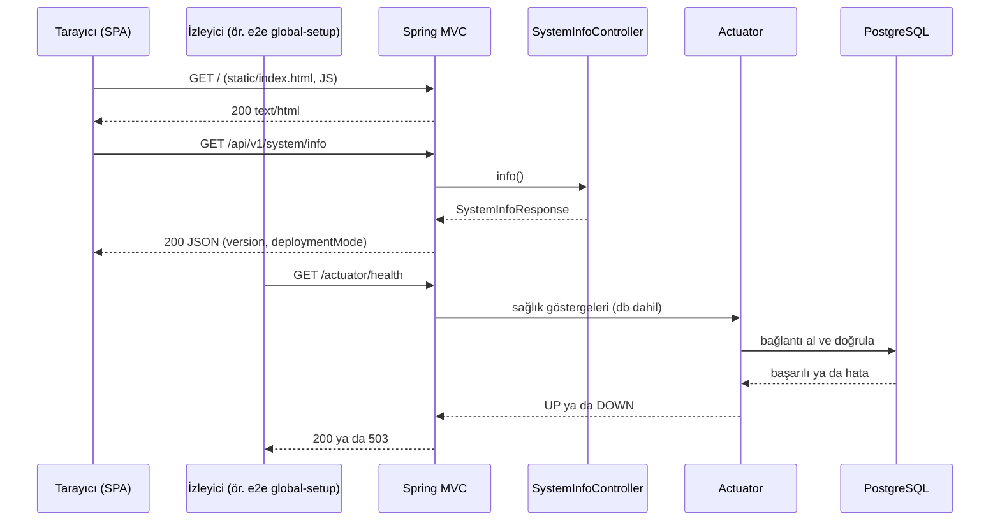
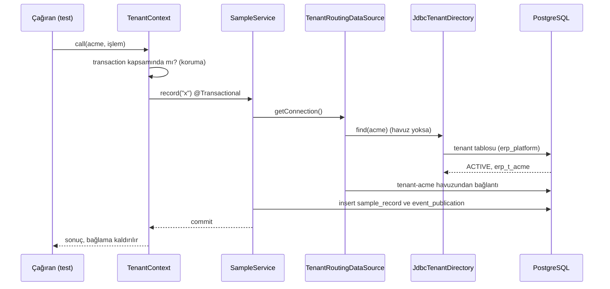
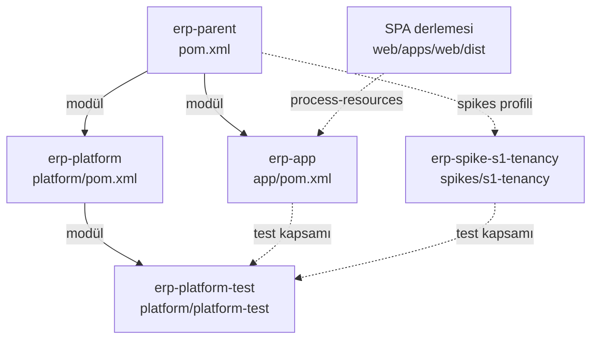
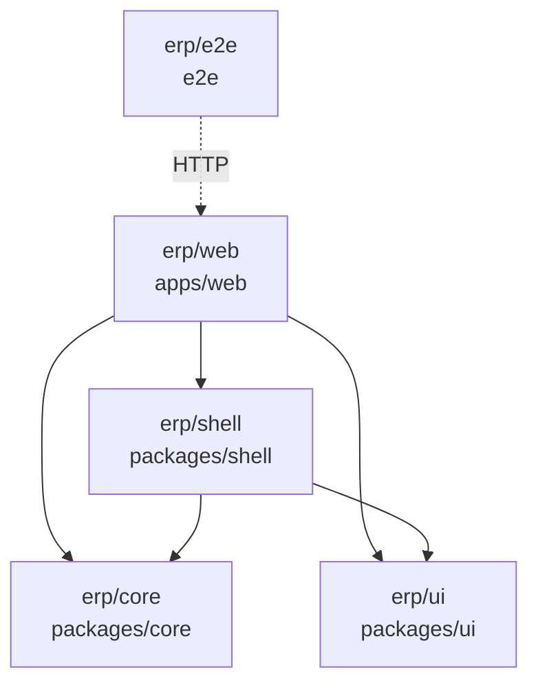
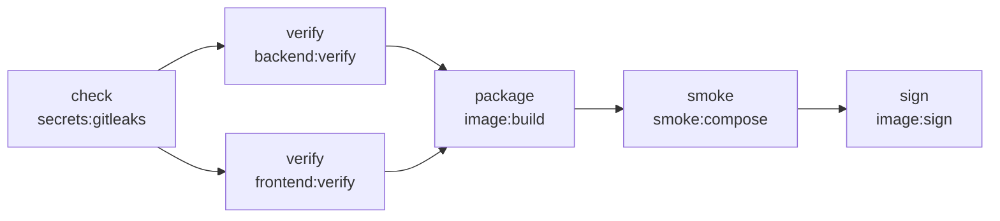
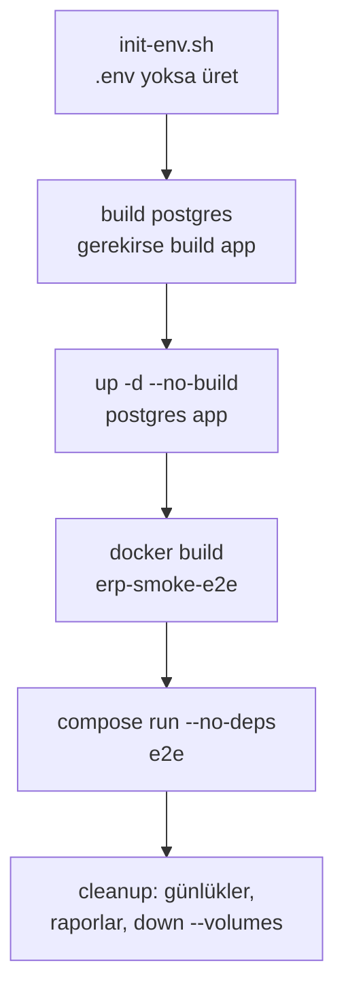
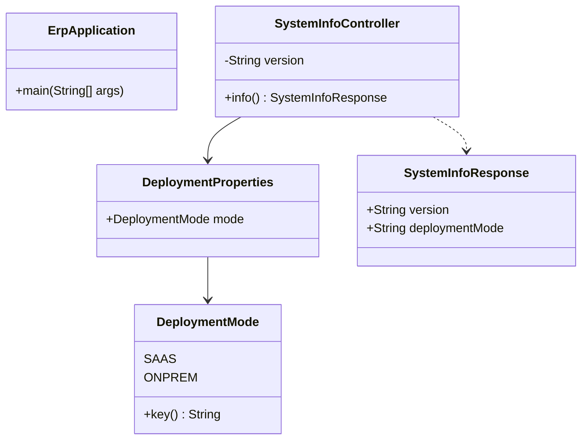
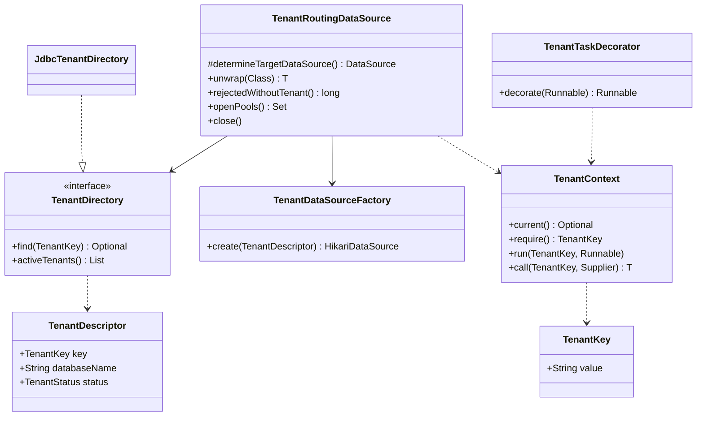
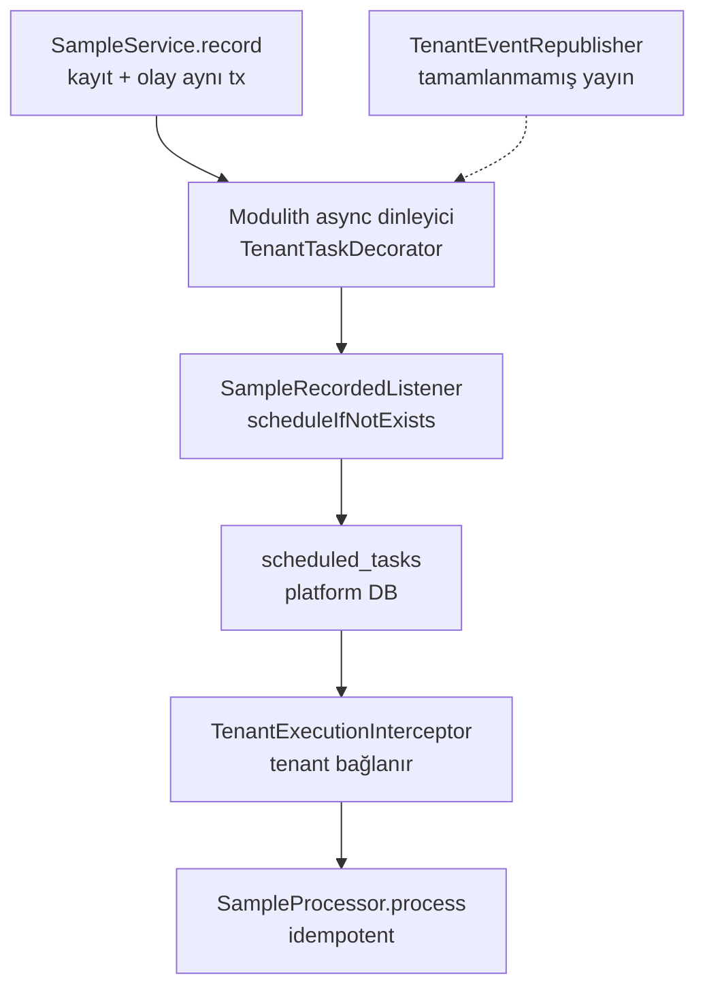
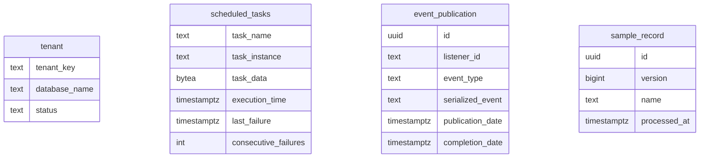

# ERP v4 Geliştirici Kılavuzu

Bu kılavuz, erp-v4 deposunun bugünkü halini anlatan başvuru kaynağıdır. Her faz sonunda koda göre güncellenir; geçmiş yalnızca "Faz geçmişi" bölümünde tutulur. Mimari kararların gerekçesi burada yeniden üretilmez; ilgili ADR'ye (`docs/adr/`) ya da mimari dokümanın bölümüne (`docs/architecture/v4-platform.md`, ör. §4.1) atıf yapılır. Kılavuzdaki komutlar 2026-10-06 tarihinde `feat/faz-0b-s1-tenancy` dalında (HEAD `4e1f6d6`) çalıştırılarak doğrulanmıştır; doğrulanamayanlar ayrıca işaretlenmiştir.

> **Kaynak önceliği:** Kod ve yapılandırma, plan dosyaları (`docs/superpowers/plans/2026-10-05-faz-0a-zemin.md`, `docs/superpowers/plans/2026-10-05-faz-0b-s1-tenancy.md`), mimari doküman, ADR'ler ve git geçmişi bu sırayla esas alınır. Kılavuz ile kod çelişirse kod doğrudur ve kılavuz düzeltilmelidir.

## 1. Sisteme genel bakış ve temel felsefe

Depo bugün iki parçadan oluşur:

- **Ürün kodu** (Faz 0A, "Zemin", yürüyen iskelet): boş bir Spring Boot uygulaması, SPA iskeleti, kalite kapıları, tek imaj, compose profilleri, duman testi ve CI tanımı. Ürün kodunda iş modülü, tenant, kimlik doğrulama ve veritabanı şeması henüz yoktur (bkz. Bölüm 10).
- **S1 tenancy spike'ı** (Faz 0B): `spikes/s1-tenancy/` altında, varsayılan Maven reaktörünün dışında duran ve yalnızca `-Pspikes` ile derlenen atılacak bir Spring Boot uygulaması. Tenant başına veritabanı, tenant'a yönlendiren DataSource, Hibernate 7, jOOQ, Spring Modulith olay kaydı ve db-scheduler yığınını otomatik testlerle sınar. Sonuçları `docs/spikes/s1-tenancy.md`'de ve ADR'lerin "Doğrulama" bölümlerindedir; kodu Faz 0 kapanışında (plan 0E) silinir (`spikes/README.md`).

44 ADR'den beşi (ADR-0003, ADR-0012, ADR-0013, ADR-0014, ADR-0015) S1 sonucuyla "Kabul edildi" durumuna geçmiştir; diğer 39'u "Önerildi" durumundadır (`docs/adr/README.md`).

> ⚠️ Spike kodu ürün koduna kopyalanmaz; Faz 1 ve Faz 2 kodu bulgulara göre yeniden yazılır (`spikes/README.md`). Bu kılavuzda spike'tan söz edilen her yer "bugün nasıl sınandığını" anlatır, ürünün nasıl yazılacağını değil.

### 1.1 Tek kod tabanı, tek imaj, iki kurulum şekli

Gerekçe ADR-0002 ve §4.1'dedir. Kodda bugünkü karşılığı aşağıdaki tabloda verilmiştir.

| Konu | Bugün kodda | Henüz karşılanmayan |
|---|---|---|
| Çalışma modu ayarı | `erp.deployment.mode`, `DeploymentProperties` record'una bağlanır; değerler `DeploymentMode` enum'u (`SAAS`, `ONPREM`) | Modun tenant kaynağına ve operasyon varsayılanlarına etkisi (Bölüm 10) |
| Varsayılan mod | `app/src/main/resources/application.yaml` içinde `onprem` | SaaS çok tenant'lı çalışma |
| Modun dışa açılması | `/api/v1/system/info` yanıtındaki `deploymentMode` alanı | `/api/v1/bootstrap` (§8.1, Faz 3) |
| Tek imaj | `deploy/docker/app.Dockerfile`: SPA gömülü tek OCI imajı | İmza (cosign) yalnızca CI tanımında; on-prem paketi ve `erpctl` yok |
| Müşteriye özel build yok (K8) | Süreç kuralı; imajda müşteri parametresi yoktur | — |

Mod değeri esnek bağlanır: `saas`, `SaaS`, `onprem`, `on-prem` kabul edilir. Bilinmeyen (`cloud`), boş ya da eksik değerde uygulama açılmayı reddeder ve hata metni özelliğin adını (`erp.deployment.mode`) içerir. Bu davranış `DeploymentPropertiesTests` ile kanıtlanır. Enum'un `key()` metodu API'de küçük harfli anahtarı (`saas`, `onprem`) `Locale.ROOT` ile üretir.

> İş kodu modu bilmemelidir (§4.1). `DeploymentMode` sınıfının Javadoc'u da bunu söyler: moda yalnızca tenant kaynağı ve operasyon varsayılanları bağlı olabilir.

### 1.2 Modüler monolit ve Spring Modulith

Gerekçe ADR-0001, katmanlar §5.1, modül anatomisi §5.3'tedir. Hedef katmanlar platform, iş modülleri, sektör paketleri ve müşteri uzantılarıdır; bağımlılık yönü her zaman üstten alta doğrudur.

Bugün kodda tek bir Spring Modulith uygulama modülü vardır: `com.smart.erp.system`. Spring Modulith, `com.smart.erp` altındaki her üst paketi bir modül sayar; modülün kök paketi açık, alt paketleri (ör. `com.smart.erp.system.web`) iç pakettir. Yapı doğrulaması `app/src/test/java/com/smart/erp/ModularityTests.java` içinde `ApplicationModules.of(...).verify()` ile her `./mvnw verify` çalışmasında yapılır (K1).

> ⚠️ §5.3'e göre her modül ayrı bir Maven modülüdür. Bugünkü `system` modülü ise `app` Maven modülünün içindedir; `SystemInfoController` Javadoc'una göre bu uç nokta Faz 3'te `/api/v1/bootstrap` ile değiştirilecek bir iskelet ucudur. Platform modülleri (`kernel`, `tenancy` …) henüz yoktur.

`platform/platform-test` bir Maven modülüdür ama Modulith uygulama modülü değildir: paylaşılan test altyapısıdır ve `ModularityTests` içinde `com.smart.erp.platformtest..` paketi doğrulamanın dışında tutulur.

S1 spike'ı ayrı bir Spring Boot uygulamasıdır (`com.smart.erp.spike.s1.SpikeApplication`) ve dört Modulith modülü içerir: `kernel`, `tenancy`, `jobs`, `sample` (Bölüm 7.8–7.11). Bu modüller §6.1 (`kernel`), §4.3–§4.5 (`tenancy`) ve §6.12'deki (`jobs`) platform modüllerinin deneme sürümleridir; yapıları spike'ın kendi `ModularityTests` sınıfıyla doğrulanır. Ürün uygulamasının modül listesi bu fazda değişmemiştir.

### 1.3 SPA'nın jar içine gömülmesi ve aynı origin

Gerekçe K8, §9.2 ("Tek build"), §9.7 ve §11.1'dedir. `app/pom.xml` içindeki `copy-spa` yürütmesi, `process-resources` aşamasında `web/apps/web/dist` klasörünü `target/classes/static` altına kopyalar; Spring Boot bu klasörü statik içerik olarak sunar. `dist` yoksa kopyalama atlanır ve jar SPA'sız üretilir.

```xml
<!-- app/pom.xml:72-93 (kısaltıldı) -->
<id>copy-spa</id>
<phase>process-resources</phase>
<outputDirectory>${project.build.outputDirectory}/static</outputDirectory>
<directory>${project.basedir}/../web/apps/web/dist</directory>
```

Sonuçları:

- SPA ve API aynı origin'den sunulur; CORS yapılandırması yoktur ve gerekmez.
- `@erp/core` içindeki `getJson` göreli yol (`/api/v1/...`) ve `credentials: 'same-origin'` kullanır.
- Geliştirmede Vite dev sunucusu (5173) `/api` ve `/actuator` isteklerini 8080'e yönlendirerek aynı origin'i taklit eder (`web/apps/web/vite.config.ts`).
- SPA'nın jar'a girmesi için `pnpm build`, Maven `package`'tan önce çalışmalıdır. İmajda bu sıra `app.Dockerfile`'ın `web` aşamasıyla sağlanır.
- BFF oturum çerezi (ADR-0006) bu aynı origin düzenine dayanacaktır; oturum ve CSRF henüz yoktur.

### 1.4 Bir isteğin tarayıcıdan veritabanına yolculuğu

Bugün ürün uygulamasında kimlik doğrulama ve tenant çözümleme yoktur; istekler doğrudan Spring MVC'ye ulaşır. Faz 0B bu yolu değiştirmemiştir; tenant'a bağlı veri erişimi yalnızca spike'ta vardır (Bölüm 1.5). Uygulama veritabanına yalnızca sağlık denetimi (`db` göstergesi) için bağlanır; `/api/v1/system/info` veritabanına dokunmaz.



Sürüm bilgisi `spring-boot-maven-plugin`'in `build-info` hedefinin ürettiği `META-INF/build-info.properties` dosyasından gelir; bu dosya sınıf yolunda yoksa `SystemInfoController.DEV_VERSION` (`0.0.0-dev`) döner.

### 1.5 Tenant bağlamında bir yazma işleminin yolculuğu (S1 spike'ı)

Kurallar §4.4 ve §4.5'te, kararlar ADR-0003 ve ADR-0015'tedir. Spike'ta HTTP ucu yoktur; tenant'ı bugün test kodu `TenantContext.run/call` ile bağlar. Tarayıcıdan gelen istekte tenant'ı çözümleyip aynı çağrıyı yapacak katman (BFF, alt alan adı eşlemesi) S2 spike'ının (plan 0C) ve Faz 1'in konusudur.



Akışın kuralları:

- Tenant transaction'dan önce bağlanır. `TenantContext.call`, transaction ya da transaction senkronizasyonu açıkken başka bir tenant'a geçişi `TenantSwitchInTransactionException` ile reddeder (§4.4 madde 7, bulgu B12).
- `TenantRoutingDataSource`, bağlı tenant yoksa `MissingTenantContextException` fırlatır ve `rejectedWithoutTenant` sayacını artırır; varsayılan tenant yoktur.
- Tenant kaydı yalnızca platform DataSource'u (`@PlatformDb`) üzerinden okunur; havuz yalnızca `ACTIVE` tenant için ve ilk istekte açılır (`minimumIdle=0`).
- Olay kaydı (`platform_events.event_publication`) iş verisiyle aynı tenant transaction'ında yazılır (ADR-0012). Olayın ardından gelen asenkron dinleyici ve iş akışı Bölüm 7.10'dadır.

## 2. Dizin anatomisi ve modül haritası

Hedef depo yerleşimi §14'tedir. §14'teki diğer üst klasörler ilk içerikleri geldiği fazda açılır; boş klasör açılmaz (plan, "Dosya haritası").

### 2.1 Kök dizin ve araç dosyaları

| Yol | Görevi | Ürettiği | Bağlı olduğu |
|---|---|---|---|
| `mise.toml` | Araç zincirini sabitler: `java = "temurin-25"`, `node = "24.21.0"`, `pnpm = "12.9.1"`, `gitleaks = "8.30.1"` | `mise install` ile kurulan araçlar | mise |
| `pom.xml` | `erp-parent`: Spring Boot 4.1.1 parent, Modulith 2.1.1 BOM, ArchUnit 1.5.1, enforcer, Error Prone 2.50.0, Spotless 3.10.3; `spikes` profili | Maven reaktörü (`platform`, `app`); `-Pspikes` ile ayrıca `spikes/s1-tenancy` | `spring-boot-starter-parent` |
| `mvnw`, `mvnw.cmd`, `.mvn/wrapper/maven-wrapper.properties` | Maven wrapper (Maven 3.9.16) | — | İnternet erişimi (ilk indirme) |
| `.mvn/jvm.config` | Error Prone'un javac iç API'lerine erişmesi için `--add-exports`/`--add-opens` | — | JDK 25 |
| `.editorconfig`, `.gitattributes` | Satır sonu LF, UTF-8; Java ve XML 4, diğerleri 2 boşluk girinti | — | Editör, git |
| `.gitignore` | `target/`, `node_modules/`, `dist/`, `.env*` (`!.env.example` hariç), duman testi çıktıları | — | git |
| `.dockerignore` | `.git`, derleme çıktıları, `docs`, `**/.env*` imaj bağlamına girmez | — | Docker |
| `.gitleaks.toml` | Varsayılan gitleaks kuralları + `pnpm-lock.yaml` istisnası | — | gitleaks |
| `renovate.json` | Bağımlılık güncelleme kuralları | Renovate PR'ları (bot henüz kurulu değil) | Renovate |
| `.gitlab-ci.yml` | CI hattı (5 aşama, 6 iş) | Test raporları, imaj, imza | GitLab, dind runner |
| `.gitlab/merge_request_templates/Default.md` | MR şablonu ve kontrol listesi | — | GitLab |
| `README.md`, `CONTRIBUTING.md` | Hızlı başlangıç, dal ve commit akışı | — | — |

### 2.2 Backend

| Yol | Görevi | Ürettiği | Bağlı olduğu |
|---|---|---|---|
| `platform/pom.xml` | `erp-platform`: platform modüllerinin toplayıcısı ve parent'ı | — | `erp-parent` |
| `platform/platform-test` | `erp-platform-test`: `ErpArchitectureRules` (K10, K12) ve `PostgresTestcontainer` (`newContainer()` dahil) | Test kapsamında kullanılan jar | ArchUnit, Testcontainers PostgreSQL, `spring-boot-testcontainers` |
| `app/pom.xml` | `erp-app`: tek Spring Boot uygulaması; build-info, SPA kopyalama, CycloneDX SBOM, lisans denetimi | `app/target/erp-app.jar` | `erp-platform-test` (test), `web/apps/web/dist` |
| `app/src/main/java/com/smart/erp/ErpApplication.java` | Giriş noktası; `@ConfigurationPropertiesScan` | — | Spring Boot |
| `app/src/main/java/com/smart/erp/system` | `system` modülü: `DeploymentMode`, `DeploymentProperties` ve `web` alt paketindeki `SystemInfoController` | `/api/v1/system/info` | — |
| `app/src/main/resources/application.yaml` | Varsayılan yapılandırma: datasource URL ve kullanıcı, sanal thread'ler, graceful shutdown, actuator, `erp.deployment.mode` | — | — |
| `app/src/main/resources/application-dev.yaml` | `dev` profili: `deploy/compose/.env` dosyasını içe aktarır, DB şifresini oradan alır | — | `deploy/compose/.env` |
| `app/src/test/java/com/smart/erp` | Uygulama testleri (Bölüm 4 ve 6) | Surefire raporları | Docker (Testcontainers) |

Jar içeriği doğrulanmıştır: `BOOT-INF/classes/static/index.html`, `META-INF/build-info.properties` ve `META-INF/sbom/application.cdx.json` bulunur.

### 2.3 Frontend

| Yol | Görevi | Ürettiği | Bağlı olduğu |
|---|---|---|---|
| `web/package.json` | Kök betikler: `lint`, `format`, `format:check`, `typecheck`, `test`, `build`, `licenses:check`; `packageManager: pnpm@12.9.1` | — | Kök geliştirme araçları |
| `web/pnpm-workspace.yaml` | Paket listesi, sürüm kataloğu (`catalog:`), `allowBuilds` | — | pnpm 12 |
| `web/pnpm-lock.yaml` | Kilit dosyası (`--frozen-lockfile` ile kullanılır) | — | — |
| `web/eslint.config.js` | Vue + TypeScript kuralları, `vue/no-v-html`, `script setup` zorunluluğu, Prettier ile çakışan kuralların kapatılması | — | ESLint 10 |
| `web/.prettierrc.json`, `web/.prettierignore` | Biçim: noktalı virgül yok, tek tırnak, 100 karakter | — | Prettier |
| `web/tsconfig.base.json` | Ortak TypeScript ayarları (`strict`, `noUncheckedIndexedAccess`) | — | TypeScript 6.0.3 |
| `web/packages/ui` | `@erp/ui`: Vuetify yapılandırması (`createErpVuetify`), temalar | — | Vuetify, `@mdi/js` |
| `web/packages/core` | `@erp/core`: HTTP istemcisi (`getJson`, `ApiError`), `useSystemInfo` | — | TanStack Query |
| `web/packages/shell` | `@erp/shell`: `ErpShell` uygulama iskeleti ve i18n metinleri | — | `@erp/core`, `@erp/ui`, vue-i18n |
| `web/apps/web` | `@erp/web`: SPA giriş noktası, Vite yapılandırması | `web/apps/web/dist` | `@erp/shell`, `@erp/core`, `@erp/ui` |
| `web/e2e` | `@erp/e2e`: Playwright duman testi | HTML ve JUnit raporları (konteynerde üretilir, `smoke.sh` dışarı kopyalar) | `@playwright/test` |
| `web/scripts/check-licenses.mjs`, `web/scripts/license-expression.mjs` | Üretim bağımlılıklarında lisans izinli listesi | — | `pnpm licenses list` |

### 2.4 Dağıtım ve dokümantasyon

| Yol | Görevi | Ürettiği | Bağlı olduğu |
|---|---|---|---|
| `deploy/compose/compose.yaml` | Compose projesi `erp`: `postgres` (profilsiz), `keycloak` ve `mailpit` (`dev`), `app` (`ci`), `e2e` (`e2e`) | Konteynerler, `postgres-data` volume'u | `deploy/compose/.env` |
| `deploy/compose/compose.smoke.yaml` | Duman testi için host portlarını kaldırır | — | `compose.yaml` |
| `deploy/compose/init-env.sh` | `.env` dosyasını rastgele sırlarla üretir; var olana dokunmaz | `deploy/compose/.env` (izin `600`) | `/dev/urandom` |
| `deploy/compose/.env.example` | Değişken adlarının listesi (değersiz) | — | — |
| `deploy/compose/postgres/Dockerfile` | `postgres:18.6` + init betikleri gömülü imaj | `erp-postgres:local` | — |
| `deploy/compose/postgres/initdb/01-create-databases.sh` | İlk açılışta `erp_platform` ve `keycloak` veritabanlarını ve sahip rollerini açar | — | `ERP_PLATFORM_DB_PASSWORD`, `KEYCLOAK_DB_PASSWORD` |
| `deploy/compose/smoke.sh` | Tek imaj + compose + Playwright duman testi | `deploy/compose/smoke-logs/` | Docker |
| `deploy/docker/app.Dockerfile` | Üç aşamalı uygulama imajı | `erp-app:local` | Node ve Temurin imajları |
| `deploy/docker/e2e.Dockerfile` | Playwright koşucu imajı | `erp-smoke-e2e` | `mcr.microsoft.com/playwright:v1.63.0-noble` |
| `docs/architecture/v4-platform.md` | Mimari ve yol haritası (onaylı, 2026-10-05) | — | — |
| `docs/adr/` | `0000-template.md`, ADR-0001…0044, dizin `README.md` (durum sütunu) | — | — |
| `docs/guides/` | `coding-rules.md`, `local-development.md`, `ci.md` ve bu kılavuz | — | — |
| `docs/spikes/s1-tenancy.md` | S1 spike'ının sonuç raporu: kanıt tablosu, bulgular B1–B20, Faz 1 girdileri ve açık maddeleri, Faz 2'ye devredilenler | — | Spike testleri |
| `docs/superpowers/plans/2026-10-05-faz-0a-zemin.md` | Faz 0A uygulama planı | — | — |
| `docs/superpowers/plans/2026-10-05-faz-0b-s1-tenancy.md` | Faz 0B (S1 spike'ı) uygulama planı | — | — |

Git'e girmeyen ama yerelde oluşan yollar: `deploy/compose/.env` (sırlar), `web/apps/web/dist` (SPA derlemesi), `app/target/` ve `spikes/s1-tenancy/target/` (Maven çıktısı), `deploy/compose/smoke-logs/` (duman testi kayıtları).

### 2.5 Modül bağımlılıkları

Maven reaktörü (oklar "içerir" ya da "kullanır" ilişkisini gösterir):



Kesikli `spikes profili` oku, modülün yalnızca `-Pspikes` verildiğinde reaktöre girdiğini gösterir. Spike, `erp-parent`'ı `relativePath` ile, `erp-platform-test`'i ise yerel Maven deposundan çözer; bu yüzden önce `./mvnw -q install -DskipTests` çalıştırılmalıdır (Bölüm 3.10).

pnpm workspace (oklar `package.json` bağımlılığını gösterir):



Diyagramda paket adlarının başındaki `@` işareti atılmıştır; Mermaid 9.1.7 düğüm metnindeki `@` ile çizim hatası vermektedir. `@erp/core` bugün `@erp/ui`'a bağlı değildir; §9.2'deki yön (`apps → modules → shell → meta-renderer → core → ui`) yalnızca izin verilen yönü tanımlar. `@erp/e2e` hiçbir workspace paketini import etmez, uygulamaya HTTP ile erişir. Bir paket yalnızca `package.json`'unda bildirdiği paketi çözebilir; bildirilmemiş bir workspace paketini import etmek `vue-tsc` denetiminde `TS2307` hatası verir (Bölüm 4.5'teki alıştırma).

### 2.6 Spike'lar (`spikes/`)

Spike'lar §15.3'teki riskli kararları gerçek kodla sınayan atılacak projelerdir (`spikes/README.md`). Varsayılan reaktörde değildir; `./mvnw verify`, imaj derlemesi ve CI onları derlemez.

| Yol | Görevi | Ürettiği | Bağlı olduğu |
|---|---|---|---|
| `spikes/README.md` | Spike'ların ne olduğu, nasıl çalıştırıldığı, ne zaman silineceği | — | — |
| `spikes/s1-tenancy/pom.xml` | `erp-spike-s1-tenancy`: JPA, jOOQ, Modulith JDBC, db-scheduler 16.12.0, Actuator, Web MVC; test kapsamında Flyway ve `erp-platform-test` | `spikes/s1-tenancy/target/` | `erp-parent`, yerel depodaki `erp-platform-test` |
| `spikes/s1-tenancy/src/main/java/com/smart/erp/spike/s1` | `SpikeApplication` ve `kernel`, `tenancy`, `jobs`, `sample` modülleri (Bölüm 7.8–7.11) | — | — |
| `spikes/s1-tenancy/src/main/resources/application.yaml` | Açılışta tenant'sız bağlantı istenmesini önleyen zorunlu ayarlar (Bölüm 4.7) | — | — |
| `spikes/s1-tenancy/src/main/resources/db/platform` | Platform DB migration'ları: `tenant`, `scheduled_tasks` | — | Flyway (yalnızca test fixture'ı) |
| `spikes/s1-tenancy/src/main/resources/db/tenant` | Tenant DB migration'ları: `platform_events.event_publication`, `sample.sample_record` | — | Flyway (yalnızca test fixture'ı) |
| `spikes/s1-tenancy/src/test/java/com/smart/erp/spike/s1/support` | Çok veritabanlı fixture (`SpikeDatabases`), test ayarları, `@SpikeTest`, bağlamı önbellek dışında açan `SpikeContexts`, `SpikeAssertions` | — | Testcontainers, Flyway |

Spike uygulamasının `application.yaml` dosyasında bağlantı ayarı yoktur. Altı bağlantı özelliği (`erp.platform.datasource.*` ve `erp.tenancy.datasource.*`) testlerde `SpikeDatabases.applicationProperties()` tarafından üretilir; spike'ı testler dışında çalıştırmanın tanımlı bir yolu yoktur.

## 3. Günlük çalışma döngüsü

Komutlar depo kökünden (`erp-v4/`) çalıştırılır; aksi belirtilmişse `cd` adımı gösterilir. Bu bölümdeki komutlar macOS (Apple Silicon), Docker Desktop (sunucu 29.5.3) ve Docker Compose v5.1.4 ile doğrulanmıştır.

### 3.1 Araç kurulumu

Java, Node, pnpm ve gitleaks yalnızca mise üzerinden kullanılır. Sistemde başka sürümler kurulu olabilir (doğrulama yapılan makinede sistem `java` 17, sistem `node` 18'dir ve global `pnpm` yoktur); Maven enforcer Java 17'yi reddeder (Bölüm 4.4).

```bash
brew install mise
mise trust
mise install
```

Doğrulama makinesinde `brew install mise` "already installed and up-to-date" uyarısı, `mise install` ise "all tools are installed" çıktısı vermiştir; temiz makinede ilk kurulum çıktısı doğrulanmamıştır (bu makinede zaten kurulu).

mise araçları iki yoldan biriyle kullanılır:

| Yol | Nasıl | Ne zaman |
|---|---|---|
| Kabuk entegrasyonu | `~/.zshrc` dosyasına `eval "$(mise activate zsh)"` satırı eklenir, yeni terminal açılır | Günlük etkileşimli çalışma |
| Önek | Her komutun başına `mise x --` yazılır, ör. `mise x -- ./mvnw verify` | Kabuk entegrasyonu yoksa, betikler ve ajanlar |

> ⚠️ Doğrulama makinesinde `~/.zshrc` dosyasına mise satırı eklenmemiştir; bu nedenle kılavuzdaki doğrulamalar `mise x --` önekiyle yapılmıştır. Kabuk entegrasyonu `zsh -c` içinde `mise activate` ve `mise hook-env` ile denenmiş, `java` 25, `node` 24.21.0 ve `pnpm` 12.9.1 görülmüştür. Kılavuzun geri kalanındaki komutlar etkin bir kabuk varsayar.

Sürümlerin kontrolü:

```bash
java -version      # openjdk version "25.0.4.1" ... Temurin
node -v            # v24.21.0
pnpm -v            # 12.9.1
gitleaks version   # 8.30.1
docker info --format '{{.ServerVersion}} {{.OSType}}/{{.Architecture}}'
```

Maven kurulmaz; `./mvnw` wrapper'ı Maven 3.9.16'yı indirir. Docker Desktop çalışıyor olmalıdır: Testcontainers testleri ve compose buna bağlıdır.

### 3.2 Sırların üretimi

```bash
deploy/compose/init-env.sh
```

Betik `deploy/compose/.env` dosyasını `umask 077` ile (izin `-rw-------`) dört rastgele değerle üretir: `POSTGRES_PASSWORD`, `ERP_PLATFORM_DB_PASSWORD`, `KEYCLOAK_DB_PASSWORD`, `KEYCLOAK_ADMIN_PASSWORD`. Dosya varsa dokunmaz ve şu satırı yazar:

```text
deploy/compose/.env already exists; leaving it untouched.
```

Dosya `.gitignore` (`.env*`) ve `.dockerignore` (`**/.env*`) ile git'e ve imaj bağlamına girmez (K9). İsteğe bağlı geçersiz kılmalar (`POSTGRES_PORT`, `APP_PORT`, `ERP_APP_IMAGE`) `.env.example` içinde yorum olarak listelenmiştir.

> `.env` içeriği hiçbir yere kopyalanmamalı, ekran görüntüsüne ya da MR açıklamasına konmamalıdır. Kaybolursa yeni değerler üretmek için dosya silinip betik yeniden çalıştırılır; ancak mevcut PostgreSQL volume'u eski şifrelerle açılmıştır ve sıfırlanması gerekir (Bölüm 3.9).

### 3.3 Yerel yığını kaldırma

```bash
docker compose -f deploy/compose/compose.yaml --profile dev up -d
docker compose -f deploy/compose/compose.yaml --profile dev ps
```

Beklenen durum: `postgres` (`erp-postgres:local`) `healthy`, `keycloak` (`quay.io/keycloak/keycloak:26.8.0`) `Up`, `mailpit` (`axllent/mailpit:v1.31.4`) `healthy`. PostgreSQL ilk açılışta (boş volume) `deploy/compose/postgres/initdb/01-create-databases.sh` betiğini çalıştırır.

| Servis | Adres | Not |
|---|---|---|
| PostgreSQL | `127.0.0.1:5432` | Veritabanları `erp_platform`, `keycloak` |
| Keycloak | `http://localhost:8180` | Yönetici `admin`, şifre `.env` içindeki `KEYCLOAK_ADMIN_PASSWORD`; uygulama henüz kullanmıyor |
| Mailpit | `http://localhost:8025` (SMTP 1025) | Uygulama henüz kullanmıyor |
| Uygulama | `http://localhost:8080` | Bölüm 3.4 |
| SPA dev sunucusu | `http://localhost:5173` | Bölüm 3.5 |

Bütün portlar yalnızca `127.0.0.1`'e bağlanır. Yığının ayakta olduğunu kanıtlayan komutlar:

```bash
docker compose -f deploy/compose/compose.yaml exec postgres \
  psql -U postgres -tAc "select datname, datlocprovider, datlocale \
  from pg_database where datname in ('erp_platform','keycloak') order by 1"
curl -fsS -o /dev/null -w '%{http_code}\n' http://127.0.0.1:8180/realms/master
curl -fsS -o /dev/null -w '%{http_code}\n' http://127.0.0.1:8025/
```

Beklenen çıktı:

```text
erp_platform|b|C.UTF-8
keycloak|b|C.UTF-8
200
200
```

### 3.4 Backend'i derleme ve çalıştırma

Tam doğrulama (derleme, Error Prone, testler, Modulith, ArchUnit, Spotless, lisans, SBOM):

```bash
./mvnw clean verify
```

Beklenen: `Tests run: 11` (`erp-platform-test`), `Tests run: 20` (`erp-app`), `BUILD SUCCESS`. Doğrulama makinesinde süre 1 dakika 17 saniye ölçülmüştür (Docker imajları önbellekteyken; sürenin çoğu Testcontainers ile açılan veritabanlarıdır). Bu komut spike'ı derlemez; spike için Bölüm 3.10'a bakılır.

> `clean` her zaman eklenmelidir. VS Code ve Antigravity'nin Java dil sunucuları `target/` altına bozuk sınıf dosyaları yazabilir; Faz 0A'da bu yaşanmıştır (Bölüm 9).

Uygulamayı `dev` profiliyle çalıştırmanın üç yolu vardır; üçü de compose yığınındaki PostgreSQL'e bağlanır:

```bash
# 1. Paketlenmiş jar ile
./mvnw -q package -DskipTests
java -jar app/target/erp-app.jar --spring.profiles.active=dev

# 2. Maven eklentisiyle (önce reaktör yerel depoya kurulur)
./mvnw -q install -DskipTests
./mvnw -pl app spring-boot:run -Dspring-boot.run.profiles=dev
```

3. IDE'de `ErpApplication` sınıfı, aktif profil `dev` olarak çalıştırılır (doğrulanmadı).

> Faz 0B doğrulamasında 8080 portu çalışan bir compose `app` servisi (`ci` profili) tarafından kullanılıyordu. Jar yolu bu yüzden `--server.port=18081` eklenerek denenmiş, aşağıdaki iki yanıt aynen alınmıştır; 8080 doluysa aynı yöntem kullanılır.

`dev` profili `application-dev.yaml` üzerinden `deploy/compose/.env` dosyasını hem depo kökünden hem `app/` klasöründen arar ve `spring.datasource.password` değerini `ERP_PLATFORM_DB_PASSWORD`'den alır. Profil verilmezse şifre boştur; uygulama yine açılır ama `readiness` `DOWN` olur (Bölüm 6.2).

Çalıştığını kanıtlayan komutlar ve beklenen yanıtlar:

```bash
curl -s http://127.0.0.1:8080/actuator/health
# {"groups":["liveness","readiness"],"status":"UP"}
curl -s http://127.0.0.1:8080/api/v1/system/info
# {"version":"0.1.0-SNAPSHOT","deploymentMode":"onprem"}
```

`/actuator/info` derleme bilgisini (`build.artifact`, `build.version` …) döner. Actuator'da yalnızca `health` ve `info` açıktır.

### 3.5 Frontend'i çalıştırma

```bash
cd web
pnpm install --frozen-lockfile
pnpm --filter @erp/web dev
```

Vite `http://localhost:5173/` adresinde açılır. Kök kontroller `web/` içinde çalışır: `pnpm format:check`, `pnpm lint`, `pnpm typecheck`, `pnpm test`, `pnpm build`, `pnpm licenses:check`.

### 3.6 Backend ile frontend arasındaki bağlantı

`web/apps/web/vite.config.ts` dev sunucusunda `/api` ve `/actuator` önekli istekleri `http://localhost:8080`'e iletir. Backend ile Vite birlikte çalışırken doğrulama:

```bash
curl -s http://localhost:5173/api/v1/system/info
# {"version":"0.1.0-SNAPSHOT","deploymentMode":"onprem"}
```

Backend kapalıyken aynı istek Vite'tan `502` döner, Vite günlüğüne `http proxy error: /api/v1/system/info` ve `ECONNREFUSED` yazılır; tarayıcıda shell "Sunucuya ulaşılamıyor" uyarısını gösterir (Bölüm 6.2). Üretimde proxy yoktur; SPA jar'dan, API ile aynı origin'den sunulur.

### 3.7 Hata ayıklama

| İhtiyaç | Yöntem |
|---|---|
| Backend'e debugger bağlamak | `java -agentlib:jdwp=transport=dt_socket,server=y,suspend=n,address=127.0.0.1:5005 -jar app/target/erp-app.jar --spring.profiles.active=dev`; IDE'den 5005'e "Remote JVM Debug" bağlanır |
| Uygulama sağlığı | `/actuator/health`, `/actuator/health/readiness`, `/actuator/health/liveness` |
| Konteyner günlükleri | `docker compose -f deploy/compose/compose.yaml logs postgres` (ya da `keycloak`, `mailpit`) |
| Veritabanına bağlanmak | `docker compose -f deploy/compose/compose.yaml exec postgres psql -U postgres -d erp_platform` |
| Frontend ağ hataları | Tarayıcı geliştirici araçları; Vite günlüğündeki `http proxy error` satırları |
| Duman testi hatası | `deploy/compose/smoke-logs/compose.log` ve `deploy/compose/smoke-logs/playwright-report/index.html` |
| Test raporları | `app/target/surefire-reports/` |

JDWP satırı doğrulanmıştır (`Listening for transport dt_socket at address: 5005`); IDE bağlantısı doğrulanmamıştır.

### 3.8 Test verisi ve örnek tenant

Ürün uygulamasında henüz yoktur: tablo, migration ve tenant kavramı yoktur; örnek tenant ve veri üretici sonraki fazlara aittir (Bölüm 10). Ürün testleri gerçek PostgreSQL 18 konteyneriyle (Testcontainers) çalışır ve kendi veritabanını açar; compose yığınına ihtiyaç duymaz.

Örnek tenant'lar bugün yalnızca S1 spike'ının test fixture'ında vardır. `SpikeDatabases` (`spikes/s1-tenancy/src/test/java/com/smart/erp/spike/s1/support/SpikeDatabases.java`) test çalışması başına bir PostgreSQL 18.6 konteyneri açar ve §7.1'deki düzeni kurar:

| Tenant | Kayıttaki durum | Veritabanı | Amacı |
|---|---|---|---|
| `acme` | `ACTIVE` | `erp_t_acme` (migration'lı) | Olağan tenant |
| `globex` | `ACTIVE` | `erp_t_globex` (migration'lı) | İzolasyon karşılaştırması için ikinci tenant |
| `initech` | `SUSPENDED` | `erp_t_initech` (migration'lı) | Askıdaki tenant: havuz açılmamalı |
| `ghost` | `ACTIVE` | Yok | Erişilemeyen tenant: hata raporlanmalı, diğerleri devam etmeli |

Platform DB'si `erp_platform`'dur. Platform rolü `erp_platform`, tenant rolü `erp_tenant`'tır; şifreler her çalıştırmada `UUID.randomUUID()` ile üretilir, depoda şifre yoktur (K9). Her veritabanının `CONNECT` yetkisi `PUBLIC`'ten alınmıştır; tenant rolü platform DB'sine bağlanamaz (`SpikeDatabasesTests`). Migration'ları uygulama değil fixture çalıştırır (`erpctl migrate` rolü, §4.6). Testler, uygulamanın yönlendirmesini atlayan süper kullanıcı sorgularıyla (`SpikeDatabases.tenantDatabase(...)`) satırın hangi veritabanına yazıldığını bağımsız olarak doğrular.

### 3.9 Yığını durdurma ve sıfırlama

```bash
# Durdur (veri korunur)
docker compose -f deploy/compose/compose.yaml --profile dev down

# Sıfırla: volume dahil her şey silinir, init betikleri yeniden çalışır
docker compose -f deploy/compose/compose.yaml --profile dev down --volumes
```

> ⚠️ `down --volumes` geliştirici veritabanını (`erp_postgres-data` volume'u) kalıcı olarak siler. Durdurma ve sıfırlama komutları kılavuz hazırlanırken dev yığınında çalıştırılmamış, aynı compose dosyasıyla ayrı bir proje adı ve port üzerinde (`POSTGRES_PORT=55432`, `-p erp-guidecheck`) doğrulanmıştır: `down` volume'u korumuş, `down --volumes` yalnızca `erp-guidecheck_postgres-data` volume'unu silmiş, `erp_postgres-data` her iki durumda da korunmuştur.

Durdurma ve sıfırlama komutları commit `86779d0`'dan beri `--profile dev` ile yazılır; böylece `dev` profilindeki `keycloak` ve `mailpit` de komutun kapsamına girer. Profil verilmeden çalıştırıldığında dev servislerinin ne olacağı doğrulanmamıştır.

### 3.10 S1 spike'ını çalıştırma

Spike compose yığınına ihtiyaç duymaz; veritabanlarını Testcontainers ile kendisi açar. Docker Desktop çalışıyor olmalıdır.

```bash
# Bir kez ve platform/ ya da kök pom.xml her değiştiğinde
./mvnw -q install -DskipTests

# Spike'ın tamamı: testler, Error Prone, Spotless, Modulith, ArchUnit
./mvnw -Pspikes -pl spikes/s1-tenancy verify
```

Beklenen: `Tests run: 90, Failures: 0, Errors: 0, Skipped: 0` ve `BUILD SUCCESS`. Doğrulama makinesinde süre 45 saniyedir; bunun yaklaşık 32 saniyesi fixture'ın konteyneri açıp veritabanlarını kurmasıdır. Bu maliyeti fixture'ı ilk kullanan test sınıfı taşır (doğrulama çalışmasında `SpikeDatabasesTests`).

Tek bir test sınıfı ve biçimlendirme:

```bash
./mvnw -Pspikes -pl spikes/s1-tenancy test -Dtest=TenantRoutingTests
# Tests run: 5, Failures: 0, Errors: 0, Skipped: 0
./mvnw -Pspikes -pl spikes/s1-tenancy spotless:apply
```

`-Pspikes` unutulursa Maven modülü bulamaz:

```text
[ERROR] Could not find the selected project in the reactor:
spikes/s1-tenancy -> [Help 1]
```

Hata ayıklama için test raporları `spikes/s1-tenancy/target/surefire-reports/` altındadır. Testler bağlam önbelleğini paylaşır (`@SpikeTest` tek bir bağlam açar); açılış ve kapanışı gözlemleyen testler (`StartupIsolationTests`) bağlamı önbellek dışında `SpikeContexts.start(...)` ile açar ve ayarları komut satırı argümanı olarak verir, çünkü `SpringApplicationBuilder.properties()` ile verilen değerleri `application.yaml` ezer (Bölüm 9).

## 4. Kalite kapıları: build'i ne kırar

Kırmızı çizgilerin (K1–K15) tanımı §3.2'dedir; denetim durumunun depo içi özeti `docs/guides/coding-rules.md`'dedir. Bu bölüm her kuralın kodda nerede zorunlu kılındığını ve ihlalde hangi hatanın görüldüğünü gösterir.

> ⚠️ Bugün hiçbir kapı kendiliğinden çalışmaz: git hook'u yoktur ve GitLab CI hattı henüz hiç çalışmamıştır (Bölüm 5.3). Kapılar yalnızca geliştirici `./mvnw verify`, frontend zinciri, `gitleaks` ve `smoke.sh` komutlarını çalıştırdığında devreye girer. Bu nedenle Bölüm 8.5'teki komut zinciri her commit öncesi çalıştırılmalıdır.

### 4.1 Zorunlu kırmızı çizgiler ve kurallar

Faz 0A deponun ilk fazı olduğu için aşağıdaki kuralların hepsi o fazda zorunlu hale gelmiştir (✅). Faz 0B ürün build'ine yeni bir kural eklememiştir; bu fazda zorunlu hale gelenler yalnızca `-Pspikes` ile çalışan spike kapılarıdır (Bölüm 4.7).

| Kural | Neden | Nerede zorunlu | İhlalde görülen hata | Faz 0A |
|---|---|---|---|---|
| K1: modüller arası erişim yalnızca açık paketler, olaylar ve view'lar üzerinden | §3.2, §5.4, ADR-0001 | `app/src/test/java/com/smart/erp/ModularityTests.java` (Spring Modulith `verify()`) | `Module 'x' depends on non-exposed type ... within module 'system'!` | ✅ |
| K9: repoda sır yok | §3.2, §10.2 | `.gitignore` (`.env*`), `.dockerignore`, gitleaks (`.gitleaks.toml`, CI işi `secrets:gitleaks`) | `leaks found: 1`, çıkış kodu 1 | ✅ |
| K10: harf dönüşümü `Locale.ROOT` ile | §3.2, §7.8, ADR-0027 | Kök `pom.xml` Error Prone `-Xep:StringCaseLocaleUsage:ERROR`; ArchUnit `ErpArchitectureRules.NO_LOCALE_LESS_CASE_CONVERSION` (`ArchitectureRulesTests.k10NoLocaleLessCaseConversion`) | `[StringCaseLocaleUsage] Specify a Locale ...` ya da `Architecture Violation ... references method <java.lang.String.toUpperCase()>` | ✅ |
| K11: nesneler `==` ile karşılaştırılmaz | §3.2 | Kök `pom.xml` Error Prone `-Xep:ReferenceEquality:ERROR`, `-Xep:BoxedPrimitiveEquality:ERROR` | `[ReferenceEquality] Comparison using reference equality instead of value equality` | ✅ |
| K12: `@Scheduled` yasak | §3.2, §6.12, ADR-0014 | ArchUnit `ErpArchitectureRules.NO_SPRING_SCHEDULING` (`ArchitectureRulesTests.k12NoSpringScheduling`) | `Method ... is meta-annotated with @Scheduled` | ✅ |
| Backend üretim bağımlılığı lisansı | §3.1 madde 6, §12.3 | `app/pom.xml` `license-maven-plugin` yürütmesi `third-party-license-check` (`verify` aşaması) | `There are some forbidden licenses used, please check your dependencies.` | ✅ |
| Frontend üretim bağımlılığı lisansı | §3.1 madde 6, §12.3 | `web/scripts/check-licenses.mjs` (`pnpm licenses:check`) | `Disallowed licenses in production dependencies:` | ✅ |
| `v-html` yasak | §10.1 | `web/eslint.config.js` kuralı `vue/no-v-html` | `'v-html' directive can lead to XSS attack  vue/no-v-html` | ✅ |
| Vue bileşeni `script setup lang="ts"` | `docs/guides/coding-rules.md` | `web/eslint.config.js` kuralları `vue/block-lang`, `vue/component-api-style` | ESLint hatası (kural adıyla; alıştırması yapılmadı) | ✅ |

Ayrıntılar:

- K10 iki katmanlıdır. Error Prone doğrudan çağrıyı (`value.toUpperCase()`) derleme hatası yapar ama `String::toUpperCase` metot referansını yakalamaz; metot referansını ArchUnit kuralı yakalar. Bu açık Faz 0A içinde kapatılmıştır (commit `6bdfc02`); kural çağrıları ve referansları "erişim" olarak eşler.
- K12 meta-anotasyonla eşler: `@Scheduled`, `@Schedules` ve `@EnableScheduling`'i taşıyan birleşik anotasyonlar da yakalanır (commit `6bdfc02`).
- Her ArchUnit kuralı negatif bir fixture testiyle birlikte eklenir (`docs/guides/coding-rules.md`; süreç kuralıdır, kodla zorlanmaz): `platform/platform-test/src/test/java/com/smart/erp/platformtest/architecture/ErpArchitectureRulesTests.java` ve aynı klasördeki `fixtures/` sınıfları.
- Lisans denetimleri, çift lisanslı bir bağımlılığı alternatiflerinden biri izinliyse geçirir. Backend'de bu `license-maven-plugin`'in davranışıdır (ör. `logback-classic`, `LGPL-2.1-only` yerine `EPL-2.0` üzerinden geçer); frontend'de `web/scripts/license-expression.mjs` SPDX ifadesini değerlendirir: `OR` için alternatiflerden biri, `AND` için her bileşen izinli olmalıdır (commit `6ce92ce`).

### 4.2 Araç kapıları

| Kapı | Ne denetler | Nerede tanımlı | Komut | İhlalde görülen hata |
|---|---|---|---|---|
| Maven enforcer | Java 25 ve üstü, Maven 3.9.0 ve üstü, POM'da çift bağımlılık sürümü yok | Kök `pom.xml`, `enforce-toolchain` | `./mvnw verify` | `JDK 25 is required. Run mise install ...` |
| Error Prone 2.50.0 | Varsayılan hata desenleri ve K10/K11 | Kök `pom.xml`, `maven-compiler-plugin`; `.mvn/jvm.config` | `./mvnw compile` | `[DesenAdı] ...` derleme hatası |
| Spotless 3.10.3 + palantir-java-format 2.101.0 | Java biçimi, kullanılmayan import | Kök `pom.xml` (`check`, `verify` aşaması) | `./mvnw verify`; düzeltme `./mvnw spotless:apply` | `The following files had format violations:` |
| ArchUnit 1.5.1 | K10, K12 | `ErpArchitectureRules`, `ArchitectureRulesTests` | `./mvnw verify` | `Architecture Violation [Priority: MEDIUM] ...` |
| Spring Modulith 2.1.1 | Modül yapısı (K1) | `ModularityTests` | `./mvnw verify` | `org.springframework.modulith.core.Violations` |
| JUnit + Testcontainers | Davranış testleri, PostgreSQL 18.6 ile | `app/src/test`, `platform/platform-test/src/test` | `./mvnw verify` | `Tests run: ..., Failures: ...` |
| Prettier 3.9.9 | Frontend biçimi | `web/.prettierrc.json` | `pnpm format:check`; düzeltme `pnpm format` | `Code style issues found in the above file.` |
| ESLint 10.12.0 | Doğruluk kuralları (biçim kuralları `skip-formatting` ile kapalı) | `web/eslint.config.js` | `pnpm lint` | `✖ 1 problem (1 error, 0 warnings)` |
| vue-tsc 3.3.12 / tsc | Tip denetimi | Paketlerin `tsconfig.json` dosyaları | `pnpm typecheck` | `error TS2322: ...` |
| Vitest 5.0.3 ve `node --test` | Birim ve bileşen testleri, lisans ifadesi testleri | Paketlerin `vitest.config.ts` dosyaları, `web/scripts/license-expression.test.mjs` | `pnpm test` | `FAIL ... AssertionError` |
| Vite 8.3.2 | Üretim derlemesi | `web/apps/web/vite.config.ts` | `pnpm build` | Derleme hatası |
| Lisans (iki taraf) | Bkz. 4.1 | `app/pom.xml`, `web/scripts/check-licenses.mjs` | `./mvnw verify`, `pnpm licenses:check` | Bkz. 4.1 |
| gitleaks 8.30.1 | Tüm git geçmişinde sır | `.gitleaks.toml` | `gitleaks git --config .gitleaks.toml --redact .` | `leaks found: N` |
| pnpm `allowBuilds` | Derleme betiği olan bağımlılık için açık karar | `web/pnpm-workspace.yaml` | `pnpm install` | `ERR_PNPM_IGNORED_BUILDS` |
| Compose zorunlu değişkenleri | `.env` olmadan yığın başlamaz | `deploy/compose/compose.yaml` (`${VAR:?...}`) | `docker compose ... up` | `required variable POSTGRES_PASSWORD is missing a value` |
| Duman testi | Tek imaj + compose + tarayıcı | `deploy/compose/smoke.sh` | `deploy/compose/smoke.sh` | `Smoke test FAILED (exit N). Logs: ...` |

Bu tablodaki kapıların tamamı Faz 0A'da eklenmiştir. Testcontainers testleri çalışan bir Docker gerektirir.

### 4.3 Henüz zorunlu olmayan K kuralları

| Kural | Özet (§3.2) | Planlanan denetim | Ne zaman |
|---|---|---|---|
| K1 (ek) | Modulith dışındaki ek denetimler | ArchUnit ek kuralları; jOOQ codegen kapsamı (§3.2) | Faz 1 (ArchUnit) |
| K2 | Jenerik modülde sektör kavramı yok | Kod incelemesi, paket isim kuralları | Süreç |
| K3 | Bir iş işlemi = tek komut + tek transaction | ArchUnit (`@Transactional` application katmanında) | Faz 1 |
| K4 | Kesinleşmiş belge ve ledger içerik kolonları değişmez | DB trigger + test | Faz 5 |
| K5 | Para, miktar, oran ve kur için `float`/`double` yok | ArchUnit | Faz 1 |
| K6 | Çekirdek iş verisi jsonb'de değil | Metadata doğrulayıcı | Faz 4 |
| K7 | Her tabloda `@Version`, güncellemede If-Match | Kernel temel sınıfı + ArchUnit | Faz 1 |
| K8 | Müşteriye özel build, dal, fork yok | Süreç | Süreç |
| K13 | Liste uç noktaları her zaman sayfalı | ArchUnit + API testleri | Faz 1 |
| K14 | Entity'ler API'de serileştirilmez | ArchUnit | Faz 1 |
| K15 | Kişisel veri alanları işaretli, logda yok | Metadata doğrulayıcı, log maskeleme | Faz 4 |

Faz sütunu `docs/guides/coding-rules.md`'den alınmıştır. K9'un "entegrasyon kimlik bilgileri şifreli saklanır" kısmının uygulanacağı bir entegrasyon henüz yoktur.

S1 spike'ı K3 ve K7'nin kalıbını örnek kodla göstermiştir (`SampleService.record`: tek komut, tek transaction; `SampleRecord`: `@Version Long`), ancak bunları denetleyen bir kural yazmamıştır. Bulgu raporu Faz 1 için ayrıca şu kapıları önerir (`docs/spikes/s1-tenancy.md`, "Faz 1 için girdiler"): açılış ve kapanış izolasyon testinin kalıcı kalite kapısı olması (B9, web katmanı dahil) ve `@GeneratedValue`/`@SequenceGenerator` kullanımını yasaklayan bir ArchUnit kuralı (§4.5'teki havuzlu sequence optimizer tuzağı, ADR-0015).

### 4.4 Kendin dene: backend

Her alıştırma bir kuralı bilerek ihlal eder, beklenen hatayı gösterir ve değişikliği geri alır. Alıştırma sonunda `git status --short` boş olmalıdır. Hata çıktıları satır kırılarak ve `...` ile kısaltılarak alıntılanmıştır. Komutlar `clean` içerir (Bölüm 9).

#### K10: parametresiz harf dönüşümü (Error Prone)

`app/src/main/java/com/smart/erp/system/GuideCheck.java` dosyası oluşturulur:

```java
package com.smart.erp.system;

class GuideCheck {

    String upper(String value) {
        return value.toUpperCase();
    }
}
```

```bash
./mvnw -q clean compile -pl app -am
```

```text
[ERROR] .../GuideCheck.java:[6,33] [StringCaseLocaleUsage] Specify a
`Locale` when calling `String#to{Lower,Upper}Case`. ...
```

Geri alma: `rm app/src/main/java/com/smart/erp/system/GuideCheck.java`

#### K10 ve K12: metot referansı ve `@Scheduled` (ArchUnit)

Aynı yola şu sınıf yazılır. Metot referansı Error Prone'dan geçer, ArchUnit'e takılır:

```java
package com.smart.erp.system;

import java.util.List;
import org.springframework.scheduling.annotation.Scheduled;

class GuideCheck {

    List<String> upper(List<String> values) {
        return values.stream().map(String::toUpperCase).toList();
    }

    @Scheduled(fixedDelay = 1000)
    void tick() {}
}
```

```bash
./mvnw clean test -pl app -am -Dtest=ArchitectureRulesTests \
  -Dsurefire.failIfNoSpecifiedTests=false
```

```text
Method <com.smart.erp.system.GuideCheck.tick()> is meta-annotated with
@Scheduled in (GuideCheck.java:...)
Method <com.smart.erp.system.GuideCheck.upper(java.util.List)> references
method <java.lang.String.toUpperCase()> in (GuideCheck.java:...)
[ERROR] Tests run: 2, Failures: 2, Errors: 0, Skipped: 0
```

Geri alma: `rm app/src/main/java/com/smart/erp/system/GuideCheck.java`

#### K11: referans eşitliği (Error Prone)

```java
package com.smart.erp.system;

import java.math.BigDecimal;

class GuideCheck {

    boolean sameCount(Integer a, Integer b) {
        return a == b;
    }

    boolean sameAmount(BigDecimal a, BigDecimal b) {
        return a == b;
    }
}
```

```bash
./mvnw -q clean compile -pl app -am
```

```text
[ERROR] .../GuideCheck.java:[8,18] [BoxedPrimitiveEquality] Comparison
using reference equality instead of value equality. ...
[ERROR] .../GuideCheck.java:[8,18] [ReferenceEquality] Comparison using
reference equality instead of value equality
[ERROR] .../GuideCheck.java:[12,18] [ReferenceEquality] Comparison using
reference equality instead of value equality
```

`Integer` karşılaştırması (satır 8) iki desene birden takılır; toplam üç hata görülür.

Geri alma: `rm app/src/main/java/com/smart/erp/system/GuideCheck.java`

#### K1: başka modülün iç paketine erişim (Spring Modulith)

Yeni bir modül paketi açılır ve `system` modülünün iç paketindeki bir tipi kullanır. Dosya: `app/src/main/java/com/smart/erp/guidecheck/GuideCheck.java`

```java
package com.smart.erp.guidecheck;

import com.smart.erp.system.web.SystemInfoResponse;

public class GuideCheck {

    public SystemInfoResponse peek() {
        return new SystemInfoResponse("x", "onprem");
    }
}
```

```bash
./mvnw clean test -pl app -am -Dtest=ModularityTests \
  -Dsurefire.failIfNoSpecifiedTests=false
```

```text
org.springframework.modulith.core.Violations:
- Module 'guidecheck' depends on non-exposed type
  com.smart.erp.system.web.SystemInfoResponse within module 'system'!
```

Geri alma: `rm -r app/src/main/java/com/smart/erp/guidecheck`

#### Spotless: biçim ihlali

`app/src/main/java/com/smart/erp/system/DeploymentMode.java` içinde `    SAAS,` satırının girintisi silinir.

```bash
./mvnw -q spotless:check -pl app
```

```text
[ERROR] Failed to execute goal com.diffplug.spotless:spotless-maven-plugin:
3.10.3:check ... The following files had format violations:
[ERROR]     src/main/java/com/smart/erp/system/DeploymentMode.java
```

Geri alma: `./mvnw -q spotless:apply -pl app` (dosyayı düzeltir; `git status --short` boş kalır).

#### Enforcer: yanlış JDK

mise etkin olmayan bir kabukta (sistem `java` 17 iken) çalıştırılır:

```bash
./mvnw validate
```

```text
[ERROR] Rule 0: org.apache.maven.enforcer.rules.version.RequireJavaVersion
failed with message:
[ERROR] JDK 25 is required. Run `mise install`
(docs/guides/local-development.md).
```

Geri alma gerekmez; komut mise ile ya da `mise x --` önekiyle çalıştırılır.

#### Lisans izinli listesi (backend)

`app/pom.xml` içindeki `<includedLicenses>` değerinden `MIT|` silinir (izinli listeden bir lisans ailesinin çıkması, izinsiz bir bağımlılık eklenmesiyle aynı sonucu verir).

```bash
./mvnw clean verify -pl app -am -DskipTests
```

```text
[WARNING] There are 1 forbidden licenses used:
[WARNING] License: 'MIT' used by 1 dependencies:
[ERROR] Failed to execute goal org.codehaus.mojo:license-maven-plugin:2.7.1:
add-third-party (third-party-license-check) on project erp-app: There are
some forbidden licenses used, please check your dependencies.
```

Geri alma: `git checkout -- app/pom.xml`

### 4.5 Kendin dene: frontend

Komutlar `web/` klasöründe çalıştırılır.

#### ESLint: `v-html`

`web/apps/web/src/App.vue` içindeki başlık satırı şu hale getirilir:

```vue
<h1 class="text-h5" v-html="$t('shell.welcome')"></h1>
```

```bash
pnpm lint
```

```text
  8:27  error  'v-html' directive can lead to XSS attack  vue/no-v-html
✖ 1 problem (1 error, 0 warnings)
```

Geri alma: `git checkout -- apps/web/src/App.vue`

#### Prettier: biçim

`web/packages/core/src/system.ts` içindeki `from './http'` ifadesi çift tırnağa çevrilir (`from "./http"`).

```bash
pnpm format:check
```

```text
[warn] packages/core/src/system.ts
[warn] Code style issues found in the above file. Run Prettier with --write
to fix.
```

Geri alma: `pnpm format` (ya da `git checkout -- packages/core/src/system.ts`).

#### TypeScript: tip hatası

`web/packages/core/src/system.ts` sonuna (20 satırlık dosyanın ardından, boş satır bırakmadan) eklenir:

```typescript
export const broken: number = 'x'
```

```bash
pnpm typecheck
```

```text
packages/core typecheck: src/system.ts(21,14): error TS2322: Type 'string'
is not assignable to type 'number'.
```

Araya boş satır bırakılırsa satır numarası `22` olur.

Geri alma: `git checkout -- packages/core/src/system.ts`

#### Vitest: Türkçe karakter

`web/packages/shell/src/i18n/tr.json` içinde `"Sürüm"` değeri `"Surum"` yapılır.

```bash
pnpm --filter @erp/shell test
```

```text
 FAIL  src/ErpShell.test.ts > ErpShell > shows the backend version ...
AssertionError: expected 'ERPSurum: 1.2.3içerik' to contain 'Sürüm'
```

Geri alma: `git checkout -- packages/shell/src/i18n/tr.json`

#### Lisans izinli listesi (frontend)

`web/scripts/check-licenses.mjs` içindeki `ALLOWED` kümesinden `'MIT',` satırı silinir.

```bash
pnpm licenses:check
```

```text
Disallowed licenses in production dependencies:
  @babel/helper-string-parser@7.29.7 (MIT)
  ...
```

Geri alma: `git checkout -- scripts/check-licenses.mjs`

#### Paket sınırı: bildirilmemiş bağımlılık

`web/packages/ui/src/guidecheck.ts` oluşturulur (`@erp/ui`, `@erp/core`'u bildirmemiştir):

```typescript
import { getJson } from '@erp/core'
export const g = getJson
```

```bash
pnpm --filter @erp/ui typecheck
```

```text
src/guidecheck.ts(1,25): error TS2307: Cannot find module '@erp/core' or
its corresponding type declarations.
```

Geri alma: `rm packages/ui/src/guidecheck.ts`

#### pnpm 12 `allowBuilds`

`web/pnpm-workspace.yaml` içindeki `vue-demi: false` satırı silinir.

```bash
pnpm install --frozen-lockfile
```

```text
Error: ERR_PNPM_IGNORED_BUILDS
  × installing dependencies
  ╰─▶ Ignored build scripts: vue-demi@0.14.10
```

Geri alma: `git checkout -- pnpm-workspace.yaml`, ardından `pnpm install --frozen-lockfile`.

### 4.6 Kendin dene: sır ve yapılandırma

#### gitleaks: sahte token

Depo dışında geçici bir klasörde rastgele, sahte bir GitHub token biçimi üretilir (dokümana gerçek görünümlü token yazılmaz):

```bash
D=$(mktemp -d)
T=$(LC_ALL=C tr -dc 'a-zA-Z0-9' </dev/urandom | head -c 36)
printf 'token = "ghp_%s"\n' "$T" > "$D/fake.txt"
gitleaks dir --redact --no-banner "$D"; echo "exit=$?"
```

```text
WRN leaks found: 1
exit=1
```

`-v` eklenirse `RuleID: github-pat` görülür. Geri alma: `rm -rf "$D"`

#### Compose: `.env` olmadan başlamama

`.env` silinmeden, compose'a boş bir env dosyası verilerek denenir:

```bash
docker compose -f deploy/compose/compose.yaml --env-file /dev/null config
```

```text
error while interpolating services.postgres.environment.POSTGRES_PASSWORD:
required variable POSTGRES_PASSWORD is missing a value: run
deploy/compose/init-env.sh first
```

Çıkış kodu 1'dir; geri alma gerekmez. Docker Compose v5.1.4 eksik değişkenlerden ilk rastladığını raporlar ve bu sıra çalıştırmadan çalıştırmaya değişir: mesajda `POSTGRES_PASSWORD` yerine `ERP_PLATFORM_DB_PASSWORD` ya da `KEYCLOAK_DB_PASSWORD` (farklı servis yollarıyla) da görülebilir.

### 4.7 S1 spike'ının kapıları

Spike modülü `erp-parent`'tan miras aldığı için Error Prone (K10, K11), Spotless ve enforcer onda da çalışır. Bunlara ek olarak spike'ın kendi testleri aşağıdaki kapıları kurar. Hepsi Faz 0B'de eklenmiştir ve yalnızca `./mvnw -Pspikes -pl spikes/s1-tenancy verify` ile çalışır; ürün build'i ve CI bunları çalıştırmaz.

| Kapı | Neden | Nerede | İhlalde görülen hata | Faz 0B |
|---|---|---|---|---|
| Açılış ve kapanışta tenant'sız bağlantı isteği yok | §4.4 madde 4, §4.5, ADR-0015; bulgu B9 | `StartupIsolationTests` (`rejectedWithoutTenant()` sıfır, açık havuz yok) | `MissingTenantContextException` ile açılış hatası ya da sayaç sıfır değil | ✅ |
| Sağlık uçları tenant'a dokunmaz | B8 | `HealthTests` | Sayaç artar ya da `components.db.status` `UP` değil | ✅ |
| Transaction içinde tenant değiştirilemez | §4.4 madde 7, B12 | `TenantContextTests`, `TransactionGuardTests` | `Expecting code to raise a throwable.` | ✅ |
| K1: spike modül yapısı | §5.4 | Spike `ModularityTests` | `org.springframework.modulith.core.Violations` | ✅ |
| K10, K12 (ArchUnit) | §3.2 | Spike `ArchitectureRulesTests` (`ErpArchitectureRules` kuralları) | `Architecture Violation ...` | ✅ |
| İzolasyon: satır yalnızca bağlı tenant'ın DB'sine gider | ADR-0003 | `TenantRoutingTests`, `SamplePersistenceTests`, `TransactionGuardTests` (süper kullanıcı tanığıyla); `JooqReadTests` | Tanık sorgusunda ya da okumada beklenmeyen satır | ✅ |

`StartupIsolationTests` ayrıca bir negatif kontrol içerir: `hibernate.boot.allow_jdbc_metadata_access=true` ile açılışın `Unable to determine Dialect without JDBC metadata` hatasıyla durduğunu doğrular (B6).

> ⚠️ `StartupIsolationTests` bağlamı web sunucusu olmadan (`WebApplicationType.NONE`) açar; Tomcat ve Web MVC açılışının tenant'sız bağlantı istemediği bu yüzden kanıtlanmamıştır. Bu, Faz 1'de kapatılacak açık maddedir (Bölüm 10.1).

#### Kendin dene: jOOQ diyalektini kaldırmak

`spikes/s1-tenancy/src/main/resources/application.yaml` içindeki `sql-dialect: POSTGRES` satırı silinir.

```bash
./mvnw -Pspikes -pl spikes/s1-tenancy test -Dtest=StartupIsolationTests
```

```text
[ERROR] Tests run: 3, Failures: 0, Errors: 2, Skipped: 0
... Error creating bean with name 'jooqConfiguration' ...
Factory method 'jooqConfiguration' threw exception with message:
No tenant is bound to this thread; tenant database access must run
inside TenantContext.run/call (doc §4.4)
```

Boot, diyalekt verilmezse açılışta bağlantı açıp diyalekti sorar (B5); routing DataSource tenant'sız isteği reddeder ve açılış durur. Geri alma: `git checkout -- spikes/s1-tenancy/src/main/resources/application.yaml`

#### Kendin dene: transaction korumasını gevşetmek

`spikes/s1-tenancy/src/main/java/com/smart/erp/spike/s1/kernel/TenantContext.java` içindeki `inTransactionScope()` yalnızca gerçek transaction'a bakacak hale getirilir (`|| TransactionSynchronizationManager.isSynchronizationActive()` kısmı silinir).

```bash
./mvnw -Pspikes -pl spikes/s1-tenancy test \
  -Dtest='TenantContextTests,TransactionGuardTests'
```

```text
TransactionGuardTests.switchingTenantInsideASupportsScope
  FailsInsteadOfWritingToTheFirstTenant ... <<< FAILURE!
Expecting code to raise a throwable.
TransactionGuardTests.jooqCannotReadAnotherTenantThrough
  ANotSupportedScope ... <<< FAILURE!
TenantContextTests.switchingTenantInsideASynchronizationOnlyScope
  IsRejected ... <<< FAILURE!
[ERROR] Tests run: 14, Failures: 3, Errors: 0, Skipped: 0
```

Bu, son incelemede bulunan hatanın kendisidir: `PROPAGATION_SUPPORTS` ve `NOT_SUPPORTED` kapsamlarında gerçek transaction olmadığı halde ilk bağlantı kapsama bağlanır ve korumasız sürümde ikinci tenant'ın yazması sessizce ilk tenant'a gider (B12, commit `117f78c`). Geri alma: `git checkout -- spikes/s1-tenancy/src/main/java/com/smart/erp/spike/s1/kernel/TenantContext.java`

## 5. Paketleme, CI, dağıtım ve duman testi

Paketleme ilkeleri §11.1, yürüyen iskelet yaklaşımı §11 girişindedir: Faz 0'dan itibaren her commit on-prem ile aynı compose paketiyle ayağa kaldırılır.

### 5.1 Uygulama imajının derleme aşamaları

`deploy/docker/app.Dockerfile` depo kökünden derlenir:

```bash
docker build -f deploy/docker/app.Dockerfile -t erp-app:local .
```

| Aşama | Taban imaj | Ne yapar | Çıktı |
|---|---|---|---|
| `web` | `node:24.21.0-bookworm-slim` | `corepack enable`; `web/` kopyalanır; `pnpm install --frozen-lockfile --filter "@erp/web..."` (pnpm deposu önbellek mount'unda); `pnpm --filter @erp/web build` | `web/apps/web/dist` |
| `backend` | `eclipse-temurin:25-jdk-noble` | `mvnw`, `pom.xml`, `.mvn`, `platform`, `app` ve SPA derlemesi kopyalanır; `./mvnw -B -ntp -pl app -am package -DskipTests` (Maven deposu önbellek mount'unda); `java -Djarmode=tools -jar ... extract --layers --launcher` | `/layers` (katmanlı jar) |
| Çalışma zamanı | `eclipse-temurin:25-jre-noble` | `erp` kullanıcısı (uid/gid 10001); katmanlar `dependencies`, `spring-boot-loader`, `snapshot-dependencies`, `application` sırasıyla kopyalanır; `USER 10001:10001`, `EXPOSE 8080` | `erp-app:local` |

Giriş komutu `java -XX:MaxRAMPercentage=75 -XX:+ExitOnOutOfMemoryError org.springframework.boot.loader.launch.JarLauncher`'dır. `ARG VERSION` (varsayılan `dev`) yalnızca `org.opencontainers.image.version` etiketine yazılır; uygulamanın bildirdiği sürüm Maven `build-info`'dan gelir (`0.1.0-SNAPSHOT`).

> ⚠️ İmaj derlemesinde testler atlanır (`-DskipTests`); testler CI'da `backend:verify` işinde çalışır. Yeni bir üst düzey Maven klasörü açıldığında (§14'teki modül, paket ve müşteri klasörleri) `backend` aşamasındaki `COPY` satırlarına eklenmelidir; Dockerfile'daki yorum bunu hatırlatır. `spikes/` klasörü bilerek kopyalanmaz: kök `pom.xml` ona yalnızca `spikes` profilinde atıf yapar ve imaj bu profil olmadan derlenir (Faz 0B doğrulamasında `smoke.sh` imajı yeniden derleyerek geçmiştir).

Doğrulama:

```bash
docker run --rm --entrypoint id erp-app:local
# uid=10001(erp) gid=10001(erp) groups=10001(erp)
F='{{.Config.User}} '
F+='{{index .Config.Labels "org.opencontainers.image.version"}}'
docker image inspect erp-app:local --format "$F"
# 10001:10001 dev
```

İmaj çalışma zamanında şu ortam değişkenleriyle yapılandırılır (compose `app` servisi): `SPRING_DATASOURCE_URL`, `SPRING_DATASOURCE_USERNAME`, `SPRING_DATASOURCE_PASSWORD`, `ERP_DEPLOYMENT_MODE`.

### 5.2 Compose profilleri

| Profil | Servisler | Kullanım |
|---|---|---|
| (yok) | `postgres` | Yalnızca veritabanı |
| `dev` | `postgres`, `keycloak`, `mailpit` | Yerel geliştirme; uygulama IDE'den ya da `./mvnw` ile çalışır |
| `ci` | `postgres`, `app` (tek imaj) | Yürüyen iskelet; `smoke.sh` kullanır |
| `e2e` | `e2e` (Playwright koşucusu) | Yalnızca `smoke.sh` kullanır |

`app` servisi compose ağında `erp-app` takma adını da taşır. Chromium'un HSTS preload listesi `app` üst düzey alan adını kapsar ve `http://app` adresini zorla HTTPS'e çevirir; bu yüzden e2e koşucusu uygulamaya `http://erp-app:8080` ile ulaşır (`compose.yaml` yorumu, `docs/guides/ci.md`).

PostgreSQL servisi `erp-postgres:local` imajını kullanır: init betikleri bind mount yerine imaja gömülüdür, çünkü bind mount kaynağı Docker daemon'unun dosya sisteminde çözülür ve uzak bir daemon'da (CI'daki docker:dind) depo yoktur (commit `4587692`, `deploy/compose/postgres/Dockerfile`).

### 5.3 CI hattı

Tanım `.gitlab-ci.yml`'dedir; iş başına açıklama ve yerel karşılıklar `docs/guides/ci.md`'dedir.

> ⚠️ GitLab CI hattı hiç çalışmamıştır. Deponun uzak adresi (`origin`) GitHub'dır; CI sağlayıcısı §20 soru 5 ile açıktır (ADR-0028). Aşağıdaki işlerin yerel karşılıkları doğrulanmıştır; CI'ın kendisi doğrulanmamıştır. Faz 0 çıkış kriterinin "CI yeşil" maddesi bir GitLab projesi ve ayrıcalıklı (privileged) docker:dind runner'ı bekler.



| Aşama | İş | Ne doğrular | Yerel karşılığı | Yerelde |
|---|---|---|---|---|
| check | `secrets:gitleaks` | Tüm git geçmişinde sır (`GIT_DEPTH: "0"`) | `gitleaks git --config .gitleaks.toml --redact .` | ✅ `no leaks found` (42 commit) |
| verify | `backend:verify` | Derleme, Error Prone, testler (Testcontainers, dind), Modulith, ArchUnit, Spotless, lisans; SBOM ve `THIRD-PARTY.txt` artifact | `./mvnw verify` | ✅ `BUILD SUCCESS` |
| verify | `frontend:verify` | Biçim, lint, tip, test, build, lisans | Bölüm 8.5'teki frontend zinciri | ✅ |
| package | `image:build` | Tek imaj; buildx ile SBOM ve provenance attestation'ı; digest `APP_IMAGE_DIGEST` olarak dotenv artifact'ına | `docker build -f deploy/docker/app.Dockerfile -t erp-app:local .` | ✅ (buildx, attestation ve push doğrulanmadı) |
| smoke | `smoke:compose` | `SKIP_BUILD=1` ile, etiketi değil digest'i (`$CI_REGISTRY_IMAGE/app@$APP_IMAGE_DIGEST`) sınar; digest boşsa hemen başarısız | `deploy/compose/smoke.sh` | ✅ `Smoke test passed.` |
| sign | `image:sign` | cosign imzası; yalnızca varsayılan dal ve tag | — | ❌ doğrulanmadı |

Hat kuralları: merge request pipeline'ları çalışır; açık MR'ı olan dal için ayrıca dal pipeline'ı çalışmaz; dal ve tag pipeline'ları çalışır. `DOCKER_HOST: tcp://docker:2375` ile TLS'siz dind kullanılır; TLS'e geçiş `docs/guides/ci.md`'dedir. CI değişkenleri `COSIGN_PRIVATE_KEY` (protected) ve `COSIGN_PASSWORD` (protected, masked) henüz tanımlı değildir; anahtar üretimi de `ci.md`'dedir.

Digest'in sınanması kararı commit `f1ba3c3` ile gelmiştir: imzalanan bayt dizisi ile duman testinden geçen bayt dizisinin aynı olması için `smoke:compose` değişebilir etiketi değil `image:build`'in ürettiği digest'i çalıştırır.

`.gitlab-ci.yml` spike'ı çalıştırmaz: `backend:verify` işi `-Pspikes` vermez. Spike testleri yalnızca yerelde, Bölüm 3.10'daki komutla çalışır; bu, plan 0B'nin "CI onu derlemez" kısıtıdır.

### 5.4 Duman ve E2E testi

`deploy/compose/smoke.sh` akışı:



- Ayrı compose projesi (`--project-name erp-smoke`) ve `compose.smoke.yaml` (host portu yok) kullanılır; bu yüzden çalışan dev yığınıyla port çakışmaz ve dev volume'una dokunmaz. Temizlikteki `down --volumes` yalnızca `erp-smoke` projesinin volume'unu siler.
- e2e imajı compose ile değil doğrudan `docker build` ile ve compose'un vereceği adla (`erp-smoke-e2e`) üretilir; `compose build e2e`, `depends_on` nedeniyle `app`'i de yeniden derleyip `$ERP_APP_IMAGE`'ın üzerine yazardı. Aynı nedenle e2e `run --no-deps` ile çalışır (commit `4587692`, `smoke.sh` yorumları).
- Playwright koşucusu `mcr.microsoft.com/playwright:v1.63.0-noble` imajıdır; etiket `web/pnpm-workspace.yaml` içindeki `@playwright/test` sürümüyle aynı olmalıdır (Renovate ikisini birlikte günceller).
- `web/e2e/global-setup.ts`, `/actuator/health` `UP` olana kadar en fazla 180 saniye bekler.
- `web/e2e/tests/smoke.spec.ts` iki test içerir: sağlık `UP`; imajdan sunulan SPA'da başlık `ERP`, `Sürüm` metni (Türkçe karakterlerin derleme → jar → imaj → tarayıcı yolunda bozulmadığının kanıtı), API'deki sürümle aynı sürüm ve `backend-unavailable` uyarısının yokluğu. Tarayıcı yereli `tr-TR`'dir.
- Çıktılar `deploy/compose/smoke-logs/` altına yazılır: `compose.log`, `playwright-report/`, `reports/junit.xml`, `test-results/` (ör. `deploy/compose/smoke-logs/reports/junit.xml`).

```bash
deploy/compose/smoke.sh
# Running 2 tests using 1 worker
#   2 passed
# Smoke test passed.

# Önceden derlenmiş bir imajı sınamak (CI biçimi)
ERP_APP_IMAGE=erp-app:local SKIP_BUILD=1 deploy/compose/smoke.sh
```

Her iki biçim de Faz 0A'da doğrulanmıştır (`SKIP_BUILD=1` ile yalnızca `erp-postgres:local` derlenir); Faz 0B'de ilk biçim yeniden çalıştırılmış ve geçmiştir. Doğrulama makinesinde Docker katman önbelleği doluyken süre 20–30 saniyedir (Faz 0B'de 21 saniye); ilk çalıştırma imaj indirme ve derleme nedeniyle daha uzun sürer (ölçülmedi). Registry'deki bir digest ile çalıştırma (CI biçimi) yerelde doğrulanmamıştır.

### 5.5 Migration ve yükseltme akışı

Ürün uygulamasında henüz yoktur. Uygulamada Flyway, migration dosyası ve şema yoktur; `erp_platform` veritabanı boştur. Migration kuralları §4.6 ve §7.9'da, orkestratör ADR-0038'dedir. On-prem güncelleme (`erpctl update`, §11.2) Faz 7'ye aittir.

S1 spike'ı §4.6'daki "migration ayrı adımdır" ilkesini sınamıştır:

- Migration dosyaları iki konumdadır: `db/platform` (platform DB) ve `db/tenant` (her tenant DB'si). Adlar `V<yyyyMMddHHmm>__<açıklama>.sql` biçimindedir (ör. `V202610051200__tenant_registry.sql`).
- Migration'ları uygulama açılışı değil, test fixture'ı (`SpikeDatabases.migrate`) Flyway API'siyle çalıştırır; bu, `erpctl migrate`'in rolüdür.
- Açılışta şema kuran her şey kapalıdır: `spring.sql.init.mode: never`, `spring.jpa.hibernate.ddl-auto: none`, `spring.modulith.events.jdbc.schema-initialization.enabled: false` (B3, B4).
- Spike'ta `flyway-core` yalnızca test kapsamındadır. Boot 4'te Flyway otomatik yapılandırması yalnızca `spring-boot-flyway` sınıf yolundayken çalışır; Faz 2 orkestratörü Flyway API'sini doğrudan kullanır, `spring-boot-starter-flyway` eklenmez (B17).
- Flyway 12.4.0 (OSS) PostgreSQL 18.6'ya migration'ları sorunsuz uygulamıştır. Flyway/Liquibase lisans teyidi plan 0E'dedir.

### 5.6 Sistemin ayakta olduğunu kanıtlayan komutlar

| Komut | Beklenen yanıt |
|---|---|
| `curl -s http://127.0.0.1:8080/actuator/health` | `{"groups":["liveness","readiness"],"status":"UP"}` (HTTP 200) |
| `curl -s http://127.0.0.1:8080/actuator/health/readiness` | `{"status":"UP"}` (veritabanı yoksa HTTP 503 ve `DOWN`) |
| `curl -s http://127.0.0.1:8080/actuator/health/liveness` | `{"status":"UP"}` |
| `curl -s http://127.0.0.1:8080/api/v1/system/info` | `{"version":"0.1.0-SNAPSHOT","deploymentMode":"onprem"}` |
| `curl -s http://127.0.0.1:8080/` | `index.html`, içinde `<title>ERP</title>` |
| `docker compose -f deploy/compose/compose.yaml --profile dev ps` | `postgres` `healthy`, `keycloak` `Up`, `mailpit` `healthy` |

## 6. Çalışma zamanı davranışı ve dayanıklılık

### 6.1 Hata modeli (RFC 9457 Problem Details)

Hedef hata modeli §8.3'tedir: `application/problem+json`, `type`, `title`, `status`, `code`, `detail`, `traceId` ve alan hataları (`errors`).

**Backend'de üretim: henüz yok.** Uygulamada Problem Details üreten bir yapılandırma ya da `@ControllerAdvice` yoktur; kernel'deki `ProblemDetail` desteği Faz 1 kapsamındadır (§15.3). Bugün hatalar Spring Boot'un varsayılan hata gövdesiyle döner:

```bash
curl -s -i -H 'Accept: application/json' \
  http://127.0.0.1:8080/api/v1/nope
```

```text
HTTP/1.1 404
Content-Type: application/json
{"timestamp":"...","status":404,"error":"Not Found","path":"/api/v1/nope"}
```

`Accept: application/problem+json` ile istendiğinde `Content-Type` `application/problem+json` olur ama gövde yine aynı varsayılan alanları (`timestamp`, `status`, `error`, `path`) taşır; `title`, `code` ve `traceId` yoktur.

**Önyüzde ayrıştırma: var.** `web/packages/core/src/http.ts` her başarısız çağrıyı `ApiError` olarak fırlatır:

| Durum | `ApiError.status` | `ApiError.problem` | `message` |
|---|---|---|---|
| Sunucuya ulaşılamadı (ağ hatası) | `0` | `undefined`; asıl hata `cause` içinde | `Network error` |
| 2xx olmayan yanıt, gövde JSON | HTTP kodu | Ayrıştırılan gövde (`ProblemDetail` olarak) | `problem.title`, yoksa `HTTP <kod>` |
| 2xx olmayan yanıt, gövde JSON değil (ör. proxy'nin HTML 502 sayfası) ya da bozuk JSON | HTTP kodu | `undefined` | `HTTP <kod>` |
| 2xx yanıt ama gövde JSON değil | HTTP kodu (ör. 200) | `undefined`; `cause` bir `SyntaxError` | `HTTP <kod>` |

Son satır Faz 0A içinde eklenmiştir (commit `e0306bc`): önceden 2xx bir HTML gövdesi ham `SyntaxError` fırlatıyordu. Bugünkü varsayılan Spring Boot gövdesinde `title` olmadığı için mesaj `HTTP 404` biçimindedir.

```typescript
// web/packages/core/src/http.ts:29-47 (satırlar kırıldı)
export async function getJson<T>(
  path: string, fetchFn: FetchFn = browserFetch): Promise<T> {
  let response: Response
  try {
    response = await fetchFn(path, {
      headers: { Accept: 'application/json' },
      credentials: 'same-origin',
    })
  } catch (cause) {
    throw new ApiError(0, undefined, { cause })
  }
  if (!response.ok) {
    throw new ApiError(response.status, await readProblem(response))
  }
  try {
    return (await response.json()) as T
  } catch (cause) {
    throw new ApiError(response.status, undefined, { cause })
  }
}
```

Shell bu hatayı kullanıcıya şöyle yansıtır: `useSystemInfo()` sorgusu hata durumuna geçerse `ErpShell.vue` `data-testid="backend-unavailable"` olan bir `v-alert` ile "Sunucuya ulaşılamıyor. Lütfen biraz sonra tekrar deneyin." metnini gösterir ve sayfa içeriğini (`slot`) çizmeye devam eder. `web/apps/web/src/main.ts` içindeki `QueryClient` sorguları bir kez yeniden dener (`retry: 1`) ve pencere odağında yenilemez.

### 6.2 Bağımlılıklar kapalıyken ya da bozukken

| Bağımlılık ve durum | Uygulamanın davranışı | Kullanıcının gördüğü | Kanıt |
|---|---|---|---|
| PostgreSQL erişilemez | Uygulama açılır; `/actuator/health` ve `/readiness` 503 `DOWN`, `/liveness` 200, `/api/v1/system/info` 200 | Shell sürümü gösterir, uyarı yok | `DatabaseUnavailableTests`; imaj veritabanısız çalıştırılarak doğrulandı |
| PostgreSQL şifresi yanlış | Aynı | Aynı | `DatabaseWrongPasswordTests` |
| `dev` profili verilmeden yerel çalıştırma | Şifre boş; `readiness` 503 `DOWN`, `info` 200 | Aynı | Elle doğrulandı (Bölüm 3.4) |
| Keycloak kapalı | Etkisi yok; uygulama henüz Keycloak'a bağlanmıyor | — | Uygulama yapılandırmasında Keycloak yok |
| Mailpit kapalı | Etkisi yok; uygulama henüz posta göndermiyor | — | — |
| Backend erişilemez (ağ hatası) | `ApiError` (`status` 0) | "Sunucuya ulaşılamıyor" uyarısı, sayfa içeriği çizilir | `http.test.ts`, `ErpShell.test.ts` |
| Proxy HTML 502 sayfası ya da JSON olmayan gövde | `ApiError` (`problem` yok) | Aynı uyarı | `http.test.ts`, `ErpShell.test.ts`; Vite proxy'nin 502'si elle doğrulandı |
| Geçersiz `erp.deployment.mode` | Uygulama açılmaz: `APPLICATION FAILED TO START`, `Failed to bind properties under 'erp.deployment.mode'` | — | `DeploymentPropertiesTests`; imajda `ERP_DEPLOYMENT_MODE=cloud` ile doğrulandı |

Bu davranışı sağlayan yapılandırma `application.yaml`'dadır: sağlık probları açıktır (`management.endpoint.health.probes.enabled: true`) ve `readiness` grubu `readinessState` ile `db` göstergelerini içerir. `liveness` veritabanını içermez; böylece bir orkestratör veritabanı kesintisinde uygulamayı yeniden başlatmaz, yalnızca trafikten çıkarır. `server.shutdown: graceful` ile kapanışta süren istekler tamamlanır.

```yaml
# app/src/main/resources/application.yaml:16-27
management:
  endpoints:
    web:
      exposure:
        include: health,info
  endpoint:
    health:
      probes:
        enabled: true
      group:
        readiness:
          include: readinessState,db
```

Veritabanısız çalıştırmanın kanıtı (port 18080, dev yığınından bağımsız; `curl` komutlarından önce uygulamanın açılması için birkaç saniye beklenir):

```bash
docker run --rm -d --name erp-nodb -p 127.0.0.1:18080:8080 erp-app:local
curl -s -w ' [%{http_code}]\n' http://127.0.0.1:18080/actuator/health
# {"groups":["liveness","readiness"],"status":"DOWN"} [503]
curl -s -w ' [%{http_code}]\n' \
  http://127.0.0.1:18080/actuator/health/liveness
# {"status":"UP"} [200]
docker stop erp-nodb
```

Compose'da `app` servisi `postgres` servisinin `service_healthy` olmasını bekler. PostgreSQL sağlık denetimi TCP üzerinden (`pg_isready -h 127.0.0.1`) yapılır; init sırasındaki geçici sunucu yalnızca soket dinlediği için servis init betikleri bitmeden `healthy` olmaz (`compose.yaml` yorumu).

### 6.3 Review Focus maddeleri

Plan dosyalarındaki "Review Focus" maddeleri ve bugünkü karşılıkları.

#### Plan 0A (Zemin)

| # | Beklenen davranış | Sağlayan kod | Kanıtlayan test ya da doğrulama |
|---|---|---|---|
| 1 | Veritabanı yokken ya da şifre yanlışken uygulama açılır; `health` ve `readiness` 503 `DOWN`, `liveness` 200, `/api/v1/system/info` 200; SPA sürümü gösterir | `application.yaml` (probes, `readiness` grubu); `SystemInfoController` veritabanı kullanmaz | `DatabaseUnavailableTests`, `DatabaseWrongPasswordTests`; SPA tarafı `ErpShell.test.ts` (sürüm gösterimi). Veritabanısız uçtan uca bir E2E testi yoktur |
| 2 | Backend erişilemezken shell çökmez, "Sunucuya ulaşılamıyor" uyarısını gösterir, içerik çizilir | `http.ts` (`getJson`, `readProblem`), `ErpShell.vue` (`isError` → `v-alert`, `slot`) | `http.test.ts` (ağ hatası, HTML 502, bozuk JSON, 2xx JSON olmayan gövde), `ErpShell.test.ts` |
| 3 | `erp.deployment.mode` `saas`, `SaaS`, `onprem`, `on-prem` ile kabul edilir; bilinmeyen ya da boş değerde açık bir hatayla açılmaz | `DeploymentProperties` (`@Validated`, `@NotNull`), `DeploymentMode` enum bağlaması | `DeploymentPropertiesTests` (bilinen dört yazım; `cloud`, boş, yalnızca boşluk, eksik) |
| 4 | `.env` yokken `init-env.sh` rastgele sır üretir, var olana dokunmaz; compose eksik değişkenle başlamaz; duman testi dev volume'unu silmez ve port çakışmasına girmez | `init-env.sh` (`-f .env` kontrolü), `compose.yaml` (`${VAR:?...}`), `smoke.sh` (`--project-name erp-smoke`), `compose.smoke.yaml` (`ports: !reset []`) | Otomatik test yok; plan doğrulama adımları. Kılavuz hazırlanırken elle doğrulandı (Bölüm 3.2, 4.6, 5.4) |
| 5 | Kazara sır commit'i yakalanır; `.env` git'te yok sayılır; `Sürüm` imajdan sunulan SPA'da bozulmadan görünür | `.gitignore` (`.env*`), `.gitleaks.toml`, CI `secrets:gitleaks`; `smoke.spec.ts` | `git check-ignore -v deploy/compose/.env` → `.gitignore:23:.env*`; sahte token alıştırması (Bölüm 4.6); `smoke.spec.ts` `getByText('Sürüm')` |

#### Plan 0B (S1 tenancy spike'ı)

Kod yolları `spikes/s1-tenancy/src/main/java/com/smart/erp/spike/s1/` altındadır; test sınıfları aynı paket yapısıyla `src/test/java` altındadır.

| # | Beklenen davranış | Sağlayan kod | Kanıtlayan test | Durum |
|---|---|---|---|---|
| 1 | Tam açılış, `/actuator/health` ve kapanış boyunca routing DataSource'tan tenant'sız bağlantı istenmez (`rejectedWithoutTenant() == 0`); hatayı yutan çerçeve kodu da sayılır | `TenantRoutingDataSource` (sayaç; `unwrap`/`isWrapperFor` yönlendirmez), `application.yaml` açılış ayarları, `ModulithTenancySupport`, `TenancyConfiguration` (`defaultCandidate = false`) | `StartupIsolationTests`, `HealthTests`, `TenantRoutingDataSourceTests.wrapperIntrospectionIsAnsweredWithoutRouting` | ⚠️ Web sunucusuz açılışla kanıtlandı (Bölüm 4.7) |
| 2 | Biçimi bozuk tenant anahtarı DB araması ya da havuz açılmadan reddedilir; bilinmeyen ve askıdaki tenant'a havuz açılmaz | `TenantKey` (`[a-z][a-z0-9_]{1,29}`), `TenantRoutingDataSource.determineTargetDataSource`; `tenant` tablosundaki `check` kısıtı | `TenantKeyTests` (`Acme`, `ışık`, `acme;drop`, boş, 31 karakter dahil 11 geçersiz değer), `TenantRoutingDataSourceTests` (`anUnknownTenant...`, `aSuspendedTenant...`) | ✅ |
| 3 | Açık transaction içinde tenant değiştirmek hata verir, ilk tenant'a yazılmaz, işlem geri alınır | `TenantContext.call` ve `inTransactionScope()` | `TenantContextTests` (4 transaction testi), `TransactionGuardTests` (`REQUIRED`, `SUPPORTS`, `NOT_SUPPORTED`) | ⚠️ İstisna yutulursa geri alma garanti değil (B12, Bölüm 10.1) |
| 4 | Askıdaki ya da DB'si erişilemeyen tenant'ın işi görünür biçimde başarısız olur ve tekrar denenir; diğer tenant'lar devam eder; veri başka yere yazılmaz | `TenantExecutionInterceptor`, routing reddi, db-scheduler'ın `OneTimeTask` yeniden deneme davranışı; `TenantEventRepublisher` (tenant başına `try/catch`, `RepublishReport`) | `TenantJobTests.aJobForASuspendedTenantFailsVisiblyAndWaitsForARetry`, `TenantEventRepublisherTests.anUnreachableTenantIsReportedAndDoesNotStopTheOthers` | ✅ |
| 5 | Olayın ikinci teslimi işi ikinci kez planlamaz; havuzdaki thread önceki görevin tenant'ını taşımaz | `SampleRecordedListener` (`scheduleIfNotExists`, iş örneği kimliği = `eventId`), `TenantTaskDecorator`, `TenantContext` (kapsam bitince önceki değer) | `TenantJobTests` (`theEventIdIsTheJobInstanceId...`, `aRedeliveryAfterTheJobCompleted...`), `TenantTaskDecoratorTests.theWorkerDoesNotKeepTheTenantForTheNextTask` | ⚠️ Tekilleştirme yalnızca iş satırı dururken; iş tamamlandıktan sonraki teslim işi yeniden çalıştırır, işler idempotent olmalı (B15) |

### 6.4 Tenant'a bağlı hata durumları (S1 spike'ı)

Ürün uygulamasında tenant olmadığı için bu davranışlar bugün yalnızca spike'ta vardır.

| Durum | Davranış | Kanıt |
|---|---|---|
| Bağlı tenant yokken tenant DB erişimi (JDBC, JPA, jOOQ) | `MissingTenantContextException` (unchecked, `IllegalStateException`); `rejectedWithoutTenant` sayacı artar | `TenantRoutingDataSourceTests`, `TenantRoutingTests.accessWithoutATenantFails`, `SamplePersistenceTests.repositoryAccessWithoutATenantFails`, `JooqReadTests.jooqWithoutATenantFails` |
| Kayıtta olmayan tenant | `TenantNotAvailableException` (`unknown tenant`), havuz açılmaz | `TenantRoutingDataSourceTests`, `TenantRoutingTests.anUnknownTenantIsRefused` |
| `ACTIVE` olmayan tenant (ör. `SUSPENDED`) | `TenantNotAvailableException` (durum adıyla), havuz açılmaz; işi başarısız sayılır, `last_failure` dolar, `consecutive_failures=1`, 5 dakika sonraya planlanır | `TenantRoutingTests.aSuspendedTenantIsRefused`, `TenantJobTests` |
| `ACTIVE` ama veritabanı yok ya da erişilemez | Bağlantı `connection-timeout` sonunda düşer (varsayılan 10 s, testlerde 2 s); yeniden yayın o tenant'ı `RepublishReport.failed` içinde raporlar, `WARN` günlüğü yazar ve diğerlerine devam eder | `TenantEventRepublisherTests.anUnreachableTenantIsReportedAndDoesNotStopTheOthers` |
| Transaction içinde başka tenant'a geçiş | `TenantSwitchInTransactionException`; istisna transaction sınırına kadar yayılırsa işlem geri alınır | `TransactionGuardTests` |
| Dinleyici başarısız ya da kapanışta tamamlanmamış yayın | Yayın tenant DB'sinde kalır; tenant dolaşan yeniden yayın onu kendi tenant'ında yeniden gönderir; kapanışta kayıt defteri sorgu yapmaz | `TenantEventRepublisherTests.aFailedPublicationIsResubmittedInItsOwnTenant`, `StartupIsolationTests` (kapanışta sayaç sıfır) |
| Geri alınan transaction | Olay yayınlanmaz, yayın kaydı yazılmaz | `EventPublicationTests.aRolledBackTransactionPublishesNothing` |

Sağlık: spike'ta `readiness` grubu `readinessState` ve `db` göstergelerini içerir; `management.health.db.ignore-routing-data-sources: true` ile `db` göstergesi yalnızca platform DB'sini denetler. Tenant DB'leri readiness konusu değildir (B8). Platform DB'si kapalıyken davranış spike'ta denenmemiştir.

## 7. Modül rehberleri

Ürün kodunda bir Spring Modulith uygulama modülü (`system`), bir platform test modülü (`platform-test`) ve beş frontend paketi vardır. İş modülü yoktur. Ürün modüllerinin tablosu, yayınladığı ya da dinlediği olayı ve SPI'ı yoktur. Bölüm 7.8–7.11, S1 spike'ının dört modülünü anlatır; tablo ve olay yalnızca bu spike modüllerinde vardır ve ER diyagramı Bölüm 7.11'dedir.

### 7.1 `system` (backend, `com.smart.erp.system`)

| Konu | İçerik |
|---|---|
| Amacı | Yürüyen iskeletin SPA → API bağlantısını kanıtlamak; çalışma modunu ve sürümü bildirmek |
| Açık tipler (modül kök paketi) | `DeploymentMode` (enum, `key()`), `DeploymentProperties` (record, `erp.deployment` öneki) |
| İç paket | `com.smart.erp.system.web`: `SystemInfoController` (paket görünürlüğünde), `SystemInfoResponse` (record) |
| REST | `GET /api/v1/system/info` → `{"version": "...", "deploymentMode": "saas" ya da "onprem"}` |
| Tablolar ve olaylar | Yok |
| Bağımlı olduğu modüller | Yok; Spring Boot `BuildProperties` (isteğe bağlı, `ObjectProvider` ile) |
| Uzatma noktası | Yok |
| Kritik kurallar | Mod esnek bağlanır, bilinmeyen değerde açılış reddedilir; sürüm yoksa `0.0.0-dev` |
| Testler | `DeploymentPropertiesTests` (`ApplicationContextRunner` ile birim), `SystemInfoControllerTests` (`@ErpIntegrationTest`) |



`ErpApplication` `@ConfigurationPropertiesScan` taşıdığı için `DeploymentProperties` ayrıca kaydedilmez. Uç noktanın Faz 3'te `/api/v1/bootstrap` ile değiştirilmesi öngörülür (`SystemInfoController` Javadoc'u, §8.1).

### 7.2 `platform-test` (backend, `com.smart.erp.platformtest`)

| Konu | İçerik |
|---|---|
| Amacı | Paylaşılan test altyapısı (§14): mimari kurallar ve PostgreSQL Testcontainer'ı |
| Açık API | `ErpArchitectureRules.NO_SPRING_SCHEDULING`, `ErpArchitectureRules.NO_LOCALE_LESS_CASE_CONVERSION`; `PostgresTestcontainer` (`IMAGE = "postgres:18.6"`, `@ServiceConnection` bean'i, `newContainer()`) |
| Kullananlar | `erp-app` test kapsamında: `ArchitectureRulesTests`, `ErpIntegrationTest`, `DatabaseWrongPasswordTests`; spike'ta `ArchitectureRulesTests` ve `SpikeDatabases` |
| Kritik kurallar | Test veritabanı compose ile aynı initdb argümanlarıyla açılır (`--encoding=UTF8 --locale-provider=builtin --builtin-locale=C.UTF-8`); gömülü veritabanı (H2 vb.) kullanılmaz |
| Testler | `ErpArchitectureRulesTests` ve `fixtures/` altındaki bilerek kural ihlal eden sınıflar; `PostgresTestcontainerTests` |

`PostgresTestcontainer.newContainer()` Faz 0B'de eklenmiştir: aynı imaj ve initdb argümanlarıyla, başlatılmamış bir konteyner döner. Birden çok veritabanı kuran fixture'lar (bugün `SpikeDatabases`) bunu kullanır; `@ServiceConnection` bean'i de artık bu metottan üretilir. `PostgresTestcontainerTests`, dönen konteynerin imajını ve `POSTGRES_INITDB_ARGS` değerini doğrular.

`PostgresTestcontainer.IMAGE` ile `deploy/compose/postgres/Dockerfile` içindeki `FROM postgres:18.6` aynı sürümde tutulur; `renovate.json`'daki özel yöneticiler ve "PostgreSQL image" grubu ikisini tek PR'da günceller (commit `2dbc596`). `TestDatabaseLocaleTests` test veritabanının `UTF8`, `builtin` sağlayıcı (`b`) ve `datlocale = C.UTF-8` ile açıldığını doğrular.

`app/src/test/java/com/smart/erp/ErpIntegrationTest.java` bileşik bir test anotasyonudur: `@SpringBootTest`, `@AutoConfigureMockMvc` ve `@Import(PostgresTestcontainer.class)`. Gerçek veritabanı gereken her uygulama testi bunu kullanır; konteyner aynı bağlamı paylaşan test sınıfları arasında yeniden kullanılır.

### 7.3 `@erp/ui` (`web/packages/ui`)

| Konu | İçerik |
|---|---|
| Amacı | Vuetify'ın tek yapılandırma noktası (ADR-0020, §9.4) |
| Dışa açık | `createErpVuetify({ locale?, dark? })`, `ErpLocale` (`'tr'` ya da `'en'`), `ErpVuetifyOptions`, `erpLight`, `erpDark`; ayrıca `@erp/ui/styles` (Vuetify global stilleri) |
| Kritik kurallar | Varsayılan dil `tr`, yedek `en`; varsayılan tema `erpLight`; ikonlar `mdi-svg` |
| Testler | `vuetify.test.ts` |

Sarmalanmış bileşenler (`ErpTextField`, `ErpGrid` …) henüz yoktur.

### 7.4 `@erp/core` (`web/packages/core`)

| Konu | İçerik |
|---|---|
| Amacı | HTTP istemcisi, hata modeli, sunucu durumu sorguları |
| Dışa açık | `getJson`, `ApiError`, `ProblemDetail`, `FetchFn`, `getSystemInfo`, `useSystemInfo`, `SystemInfo` |
| Kritik kurallar | Her başarısız çağrı `ApiError`'dır (Bölüm 6.1); `useSystemInfo` sorgu anahtarı `['system', 'info']`, `staleTime: Infinity` |
| Testler | `http.test.ts` (7 test), `system.test.ts` (1 test) |

`FetchFn` parametresi testlerde sahte `fetch` vermek içindir; üretimde `globalThis.fetch` kullanılır.

### 7.5 `@erp/shell` (`web/packages/shell`)

| Konu | İçerik |
|---|---|
| Amacı | Uygulama iskeleti (§9.3); bugün yalnızca üst çubuk, sürüm ve sunucu uyarısı |
| Dışa açık | `ErpShell` bileşeni (varsayılan `slot`), `shellMessages` (`{ tr, en }`) |
| i18n anahtarları | `shell.title`, `shell.version`, `shell.backendUnavailable`, `shell.welcome` |
| E2E sözleşmesi (`data-testid`) | `shell-title`, `system-version`, `backend-unavailable` |
| Testler | `ErpShell.test.ts`; `vitest.setup.ts` jsdom'da eksik `ResizeObserver` ve `matchMedia` için yer tutucu sağlar |

### 7.6 `@erp/web` (`web/apps/web`)

`main.ts` sırasıyla `@erp/ui/styles`'ı yükler, `createErpVuetify()`, `VueQueryPlugin` (`QueryClient`: `retry: 1`, `refetchOnWindowFocus: false`) ve `i18n`'i (`web/apps/web/src/i18n.ts`: `legacy: false`, `locale: 'tr'`, `fallbackLocale: 'en'`, mesajlar `shellMessages`) kurar ve `App.vue`'yu bağlar. `App.vue`, `ErpShell` içinde `shell.welcome` başlığını gösterir. Router, Pinia ve modül manifestleri yoktur.

### 7.7 `@erp/e2e` (`web/e2e`)

Playwright 1.63.0 duman testleri (Bölüm 5.4). Kurgulanan çalıştırma yolu `smoke.sh`'in başlattığı konteynerdir; yerel tarayıcıyla çalıştırma doğrulanmamıştır. `baseURL` `E2E_BASE_URL` ortam değişkeninden gelir, yoksa `http://localhost:8080`'dir. Kök `pnpm test` bu paketi dışarıda bırakır (`--filter "!@erp/e2e"`).

### 7.8 Spike: `kernel` (`com.smart.erp.spike.s1.kernel`)

Bölüm 7.8–7.11'deki sınıflar `spikes/s1-tenancy/src/main/java/com/smart/erp/spike/s1/` altındadır. Modüller arası bağımlılık yönü `sample → jobs → tenancy → kernel` biçimindedir (`sample` ayrıca `kernel`'i, `jobs` ayrıca `kernel`'i kullanır); spike `ModularityTests` bunu doğrular.

| Konu | İçerik |
|---|---|
| Amacı | §6.1'deki kernel'in tenant ve kimlik parçalarının deneme sürümü |
| Açık tipler | `TenantKey` (record), `TenantContext` (`current`, `require`, `run`, `call`), `MissingTenantContextException`, `TenantSwitchInTransactionException`, `UuidV7` (`next`) |
| Tablolar ve olaylar | Yok |
| Bağımlılıklar | Spike modülü yok; `spring-tx` (`TransactionSynchronizationManager`) |
| Kritik kurallar | Tenant anahtarı `[a-z][a-z0-9_]{1,29}`; bağlama yalnızca kapsamla (setter ve varsayılan tenant yok); transaction ya da senkronizasyon kapsamında başka tenant'a geçiş yok; `UuidV7` tek üreteçte kesin artan |
| Testler | `TenantKeyTests`, `TenantContextTests`, `UuidV7Tests`, `HibernateUuidV7Tests` (öğrenme testi) |

`TenantContext` ThreadLocal tutar ama dışarıya yalnızca kapsam API'si açar; kapsam bitince önceki değer geri konduğu için havuzdaki bir thread bayat tenant taşıyamaz (B11). Koruma kapsam girişindedir:

```java
// kernel/TenantContext.java:46-59
TenantKey previous = CURRENT.get();
if (inTransactionScope() && !tenant.equals(previous)) {
    throw new TenantSwitchInTransactionException(previous, tenant);
}
CURRENT.set(tenant);
try {
    return action.get();
} finally {
    if (previous == null) {
        CURRENT.remove();
    } else {
        CURRENT.set(previous);
    }
}
```

`inTransactionScope()`, `isActualTransactionActive() || isSynchronizationActive()` döner. Yalnızca gerçek transaction'a bakmak yetmez: `SUPPORTS`, `NOT_SUPPORTED` ve `NEVER` kapsamlarında da ilk bağlantı kapsama bağlanır (B12, Bölüm 4.7'deki alıştırma). Neden ThreadLocal seçildiği (Java 25 `ScopedValue` yerine) B11'dedir.

`UuidV7` RFC 9562'nin 1. yöntemini uygular: 48 bit milisaniye, 12 bit sayaç, 62 bit rastgele. Saat durduğunda ya da geri gittiğinde sayaç ilerler, sayaç taşarsa zaman damgası bir milisaniye öne alınır. Kimlik nesne kurulurken bilinir; neden Hibernate'in `@UuidGenerator(style = VERSION_7)`'si yerine uygulama üreteci seçildiği ADR-0013 Doğrulama bölümünde ve B14'tedir.

### 7.9 Spike: `tenancy` (`com.smart.erp.spike.s1.tenancy`)

| Konu | İçerik |
|---|---|
| Amacı | §4.3–§4.5: platform DataSource'u, tenant'a yönlendiren DataSource, tenant kaydı, bağlam yayılımı; Modulith ve jOOQ uyum parçaları |
| Açık tipler | `PlatformDb` (qualifier), `PlatformDataSourceProperties`, `TenantDataSourceProperties`, `TenantStatus`, `TenantDescriptor`, `TenantDirectory`, `TenantNotAvailableException`, `TenantDataSourceFactory`, `TenantRoutingDataSource`, `TenantTaskDecorator` |
| İç tipler | `TenancyConfiguration`, `JdbcTenantDirectory`, `FlushBeforeJooqQueryListener`, `JooqListenerConfiguration`, `ModulithTenancySupport`, `TenantSafeEventPublicationRegistry` |
| Tablolar | Platform DB'sinde `tenant` (okur; şemayı migration kurar) |
| Testler | `TenantDataSourceFactoryTests`, `TenantRoutingDataSourceTests`, `TenantTaskDecoratorTests`, `JdbcTenantDirectoryTests`, `TenantRoutingTests`, `HibernateBootstrapTests`, `JooqReadTests`, `StartupIsolationTests`, `HealthTests` |



Bean'ler `TenancyConfiguration`'dadır:

| Bean | Ne yapar | Neden böyle |
|---|---|---|
| `platformDataSource` | Platform DB'sine Hikari havuzu (`erp.platform.datasource.*`) | `@Bean(defaultCandidate = false)` + `@PlatformDb`: JPA, jOOQ, `JdbcClient` ve Modulith tek aday olarak routing DataSource'u alır, `@Primary` gerekmez (B8, ADR-0015) |
| `tenantDirectory` | `JdbcTenantDirectory`, kaydı platform DB'sinden okur | Kayıt hiçbir zaman routing DataSource'tan okunmaz |
| `tenantDataSource` | `TenantRoutingDataSource` | Statik hedef haritası ve varsayılan hedef yok; havuz tembel ve yalnızca `ACTIVE` tenant için |
| `modulithTenancySupport` | Modulith'in `databaseType` bean'ini bağlantısız `POSTGRES` ile, kayıt defterini `TenantSafeEventPublicationRegistry` ile karşılar | `static`: bir `BeanPostProcessor`, yakaladığı bean'lerden önce var olmalıdır (B1, B2) |
| `tenantTaskDecorator` | Gönderenin tenant'ını işçi thread'ine taşır | Boot her `TaskDecorator` bean'ini `applicationTaskExecutor`'a bileştirir (B10) |

`JooqListenerConfiguration`, `FlushBeforeJooqQueryListener`'ı bir `DefaultExecuteListenerProvider` bean'i olarak kaydeder: okuma-yazma bir JPA transaction'ında her jOOQ sorgusundan önce bağlı `EntityManager` flush edilir (§7.7, B13). Sınıf adı `JooqConfiguration` olamaz; Boot'un aynı adlı bean'iyle çakışır (Bölüm 9).

Tenant havuzu ayarları (`TenantDataSourceProperties`, önek `erp.tenancy.datasource`): `url-template` (`{database}` içermek zorunda), `username`, `password`, `maximum-pool-size` (varsayılan 4), `idle-timeout` (5m), `connection-timeout` (10s). `TenantDataSourceFactory` ayrıca `minimumIdle=0` verir; havuz oluşturmak bağlantı açmaz.

> ⚠️ `ModulithTenancySupport` Modulith 2.1.1'in iç bean adlarına (`databaseType`, `eventPublicationRegistry`) ve sınıf adına bağlıdır. Modulith yükseltmesi bunları değiştirirse `StartupIsolationTests` kırılır. Kayıt defteri `postProcessBeforeInstantiation`'dan döndüğü için Spring'in normal oluşturma yolunu atlar ve kapanış geri çağrısı hiç kaydedilmez; asıl çözüm bu atlamadır, `TenantSafeEventPublicationRegistry#destroy()` çağrılmaz (Faz 1 açık madde 3, Bölüm 10.1).

### 7.10 Spike: `jobs` (`com.smart.erp.spike.s1.jobs`)

| Konu | İçerik |
|---|---|
| Amacı | §6.12: db-scheduler'ın platform DB'sinde çalışması, tenant işleri, tenant dolaşan olay yeniden yayını (ADR-0012, ADR-0014) |
| Açık tipler | `TenantScopedTaskData`, `TenantEventRepublisher` (`republishAll(Duration)`), `RepublishReport`, `JobsProperties`, `EventRepublishProperties` |
| İç tipler | `JobsConfiguration`, `TenantExecutionInterceptor`, `JsonTaskDataSerializer`, `DelayedFixedDelay` |
| Tablolar | Platform DB'sinde `scheduled_tasks` (db-scheduler 16.12.0 şeması) |
| Platform işi | `platform.event-republisher` (`RecurringTask`, ilk çalışma bir aralık sonra) |
| Testler | `TenantExecutionInterceptorTests`, `TenantEventRepublisherTests`; ayrıca `sample` altındaki `TenantJobTests` |

`JobsConfiguration` üç bean kurar:

- `scheduler`: `Scheduler.create(platformDataSource, ...)`; iş verisi Jackson 3 ile JSON (`JsonTaskDataSerializer`), `TenantExecutionInterceptor` iş verisi `TenantScopedTaskData` ise tenant'ı işin süresince bağlar. Ayarlar `spike.jobs.*`: `polling-interval` (1s), `threads` (4), `shutdown-max-wait` (30s).
- `schedulerLifecycle`: zamanlayıcı bağlam ayağa kalktıktan sonra başlar, DataSource'lar kapanmadan durur. `isPauseable()` `false` döner: db-scheduler `stop()`'tan sonra yeniden başlatılamaz, Spring 7 ise önbellekteki test bağlamlarını duraklatıp yeniden başlatır (B20).
- `eventRepublisherTask`: `DelayedFixedDelay` ile ilk çalışma bir aralık sonradır (`spike.events.republish.interval`, varsayılan 1m; `min-age` 5m). db-scheduler'ın `FixedDelay`'i açılışta hemen çalışır ve her tenant için havuz açardı (B16).

Bir olaydan tenant işine giden akış:



> ⚠️ İş örneği kimliği olayın `eventId`'sidir; `scheduleIfNotExists` ikinci teslimi yalnızca iş satırı dururken reddeder. `OneTimeTask` tamamlanınca satırı silindiği için tamamlanmadan sonra gelen tekrar teslim işi yeniden çalıştırır. Gerçek garanti idempotent iştir (B15). Spec §6.12'deki "iş bir kez planlanır" cümlesinin bu pencereyle sınırlanması bekleyen bir karardır (Bölüm 10.1).

`TenantEventRepublisher` her `ACTIVE` tenant için `TenantContext.run` içinde Modulith'in `IncompleteEventPublications.resubmitIncompletePublicationsOlderThan(minAge)` metodunu çağırır; hata veren tenant `RepublishReport.failed` içine yazılır, diğerleri devam eder. Her çalışmada her aktif tenant için havuz açması spike basitleştirmesidir; §6.12'nin istediği etkinlik göstergesi Faz 2'dedir (B16).

### 7.11 Spike: `sample` (`com.smart.erp.spike.s1.sample`)

| Konu | İçerik |
|---|---|
| Amacı | Yığının tamamını tek bir örnek iş akışıyla sınamak: JPA yazma, jOOQ okuma, olay, dinleyici, iş |
| Açık tipler | `SampleRecord` (entity), `SampleRecordRepository`, `SampleQueries` (jOOQ, codegen yok), `SampleRecorded` (olay), `SampleService`, `SampleProcessor`, `ProcessSampleData` (iş verisi) |
| İç tipler | `SampleJobs` (`sample.process-sample` işi), `SampleRecordedListener` |
| Tablolar | Tenant DB'sinde `sample.sample_record` |
| Yayınladığı olay | `SampleRecorded(eventId, tenantKey, sampleId, occurredAt)` |
| Dinlediği olay | `SampleRecorded` (`@ApplicationModuleListener`, commit sonrası, asenkron) |
| Testler | `HibernateBootstrapTests`, `SamplePersistenceTests`, `TransactionGuardTests`, `JooqReadTests`, `EventPublicationTests`, `TenantJobTests` |

Kritik kurallar: kimlik `SampleRecord` kurulurken `UuidV7.next()` ile atanır; `@Version` alanı `Long` (sarmalayıcı) olduğu için Spring Data atanmış kimlikli yeni kaydı `merge` değil `persist` eder (B14); `markProcessed` idempotenttir (tekrar çalışan iş zaman damgasını değiştirmez); dinleyici olayın tenant'ının bağlı tenant ile aynı olduğunu denetler.

Spike'ın bütün tabloları aşağıdadır (platform DB'sinde `tenant` ve `scheduled_tasks`; her tenant DB'sinde `platform_events.event_publication` ve `sample.sample_record`). Tablolar arasında yabancı anahtar yoktur: iş satırı tenant ve örnek kimliğini JSON iş verisinde (`task_data`), yayın kaydı olayı serileştirilmiş metin olarak (`serialized_event`) taşır. `scheduled_tasks` ve `event_publication` için seçilmiş altı kolon gösterilmiştir; tam tanım migration dosyalarındadır.



## 8. Uygulamalı el kitabı

Tarifler depodaki gerçek konvansiyonları izler. Bölüm 8.1 ve 8.2'deki örnekler kılavuz hazırlanırken depoya geçici olarak eklenmiş, tüm kontrollerden geçtiği görülmüş ve geri alınmıştır; depoda bulunmazlar. Bölüm 8.1 Faz 0B'de yeniden denenmiştir; Bölüm 8.2 Faz 0A'da denenmiştir ve ilgili önyüz dosyaları o tarihten beri değişmemiştir. Bölüm 8.6, spike'taki mevcut örnek akışı adım adım açıklar.

### 8.1 Yeni backend REST ucu

Örnek: `system` modülüne `GET /api/v1/system/deployment-mode` eklemek.

1. Uç nokta, modülün `web` alt paketine (iç paket, §5.3) yazılır. Controller ve yöntemleri paket görünürlüğündedir; bağımlılıklar constructor ile alınır (`docs/guides/coding-rules.md`). Yol `/api/v1/<modül>/...` biçimindedir (§8.1).

```java
// app/src/main/java/com/smart/erp/system/web/DeploymentModeController.java
package com.smart.erp.system.web;

import com.smart.erp.system.DeploymentProperties;
import org.springframework.web.bind.annotation.GetMapping;
import org.springframework.web.bind.annotation.RequestMapping;
import org.springframework.web.bind.annotation.RestController;

@RestController
@RequestMapping("/api/v1/system")
class DeploymentModeController {

    private final DeploymentProperties deployment;

    DeploymentModeController(DeploymentProperties deployment) {
        this.deployment = deployment;
    }

    @GetMapping("/deployment-mode")
    DeploymentModeResponse mode() {
        return new DeploymentModeResponse(deployment.mode().key());
    }
}
```

2. Yanıt DTO'su bir `record`'dur. Entity hiçbir zaman döndürülmez (K14, henüz otomatik denetlenmiyor).

```java
// app/src/main/java/com/smart/erp/system/web/DeploymentModeResponse.java
package com.smart.erp.system.web;

public record DeploymentModeResponse(String mode) {}
```

3. Hata modeli: Problem Details üretimi kernel ile Faz 1'de gelir (§8.3, §15.3). O zamana kadar uç noktadaki hatalar Spring Boot'un varsayılan gövdesiyle döner ve önyüzde `ApiError` olarak ayrıştırılır (Bölüm 6.1).

4. Entegrasyon testi `@ErpIntegrationTest` (gerçek PostgreSQL 18.6, tam bağlam, `MockMvcTester`) ile yazılır. Test sınıfı adı `*Tests` ile biter.

```java
// app/src/test/java/com/smart/erp/system/web/DeploymentModeControllerTests.java
package com.smart.erp.system.web;

import static org.assertj.core.api.Assertions.assertThat;

import com.smart.erp.ErpIntegrationTest;
import org.junit.jupiter.api.Test;
import org.springframework.beans.factory.annotation.Autowired;
import org.springframework.test.web.servlet.assertj.MockMvcTester;

@ErpIntegrationTest
class DeploymentModeControllerTests {

    @Autowired
    MockMvcTester mvc;

    @Test
    void returnsTheConfiguredMode() {
        assertThat(mvc.get().uri("/api/v1/system/deployment-mode"))
                .hasStatusOk()
                .bodyJson()
                .isLenientlyEqualTo("""
                        {"mode": "onprem"}
                        """);
    }
}
```

5. Spring bağlamı gerektirmeyen mantık için birim testi yazılır; yapılandırma bağlaması `ApplicationContextRunner` ile denenir (örnek: `DeploymentPropertiesTests`).

6. Mimari kurallara uyum ayrıca kayıt gerektirmez: `ArchitectureRulesTests` ve `ModularityTests` `com.smart.erp` altındaki bütün üretim sınıflarını tarar. Başka bir modülün yalnızca kök paketindeki tipleri kullanılabilir (K1).

7. Doğrulama ve biçim:

```bash
./mvnw -q spotless:apply -pl app
./mvnw clean verify
```

Beklenen: `erp-app` için `Tests run: 21` (yeni test dahil), `BUILD SUCCESS`.

8. Önyüz istemcisi gerekiyorsa `@erp/core`'a `getSystemInfo` örneğindeki gibi bir fonksiyon ve TanStack Query sorgusu eklenir (`web/packages/core/src/system.ts`).

### 8.2 Yeni önyüz bileşeni, ekranı ve i18n metni

Örnek: çalışma modunu gösteren bir `SystemModeChip` bileşeni `@erp/shell`'e eklenir ve ana ekranda kullanılır.

1. Kullanıcıya görünen metin önce `tr` ve `en` dosyalarına eklenir; anahtar düzeni `<modül>.<kaynak>.<alan>`'dır (§9.8). `web/packages/shell/src/i18n/tr.json` içinde `shell` nesnesine:

```json
"mode": {
  "saas": "Bulut (SaaS)",
  "onprem": "Kurum içi"
}
```

`web/packages/shell/src/i18n/en.json` içine aynı anahtarlar: `"saas": "Cloud (SaaS)"`, `"onprem": "On-premises"`.

2. Bileşen `script setup lang="ts"` ile yazılır (ESLint zorlar); Vuetify bileşenleri `vite-plugin-vuetify` ile otomatik içe aktarılır. E2E kancası `data-testid` ile verilir.

```vue
<!-- web/packages/shell/src/SystemModeChip.vue -->
<script setup lang="ts">
import { useSystemInfo } from '@erp/core'
import { useI18n } from 'vue-i18n'

const { t } = useI18n()
const { data: systemInfo } = useSystemInfo()
</script>

<template>
  <v-chip v-if="systemInfo" size="small" data-testid="system-mode">
    {{ t(`shell.mode.${systemInfo.deploymentMode}`) }}
  </v-chip>
</template>
```

3. Paket dışına açılır: `web/packages/shell/src/index.ts` dosyasına `export { default as SystemModeChip } from './SystemModeChip.vue'` satırı eklenir.

4. Ekranda kullanılır (`web/apps/web/src/App.vue`):

```vue
<script setup lang="ts">
import { ErpShell, SystemModeChip } from '@erp/shell'
</script>

<template>
  <ErpShell>
    <v-container>
      <h1 class="text-h5">{{ $t('shell.welcome') }}</h1>
      <SystemModeChip />
    </v-container>
  </ErpShell>
</template>
```

5. Bileşen testi `ErpShell.test.ts` desenini izler: sahte `fetch`, `retry: false` ile `QueryClient`, Türkçe `i18n`.

```typescript
// web/packages/shell/src/SystemModeChip.test.ts
import { createErpVuetify } from '@erp/ui'
import { QueryClient, VueQueryPlugin } from '@tanstack/vue-query'
import { flushPromises, mount } from '@vue/test-utils'
import { afterEach, describe, expect, it, vi } from 'vitest'
import { createI18n } from 'vue-i18n'
import SystemModeChip from './SystemModeChip.vue'
import { shellMessages } from './i18n'

afterEach(() => {
  vi.unstubAllGlobals()
})

describe('SystemModeChip', () => {
  it('shows the deployment mode in Turkish', async () => {
    const body = '{"version":"1.2.3","deploymentMode":"onprem"}'
    const headers = { 'content-type': 'application/json' }
    const ok = async () => new Response(body, { status: 200, headers })
    vi.stubGlobal('fetch', vi.fn(ok))

    const queryClient = new QueryClient({
      defaultOptions: { queries: { retry: false } },
    })
    const i18n = createI18n({
      legacy: false,
      locale: 'tr',
      messages: shellMessages,
    })
    const wrapper = mount(SystemModeChip, {
      global: {
        plugins: [createErpVuetify(), [VueQueryPlugin, { queryClient }], i18n],
      },
    })

    await vi.waitFor(async () => {
      await flushPromises()
      const chip = wrapper.get('[data-testid="system-mode"]')
      expect(chip.text()).toBe('Kurum içi')
    })
  })
})
```

6. Doğrulama (`web/` içinde):

```bash
pnpm format:check && pnpm lint && pnpm typecheck
pnpm test && pnpm build
```

Beklenen: `packages/shell test: Tests 3 passed (3)` ve diğer kontroller hatasız.

> Vuetify yalnızca `@erp/ui` üzerinden yapılandırılır; bir paket yalnızca `package.json`'unda bildirdiği paketi import edebilir (Bölüm 4.5). Yeni bir modül paketi (`@erp/mod-...`, §9.2) bugün yoktur; ilk modül paketi geldiğinde bu tarif genişletilmelidir.

### 8.3 Yeni veritabanı migration'ı

Ürün kodunda henüz yoktur: ürün uygulamasında Flyway bağımlılığı ve migration klasörü bulunmaz. Kuralları §7.9 ve `docs/guides/coding-rules.md` tanımlar: modül klasöründe `V<yyyyMMddHHmm>__<açıklama>.sql` adı, genişlet/daralt kuralı (§4.6), `snake_case` ve tekil tablo adları (§7.2). Ürün tarifi, migration orkestratörünün (ADR-0038) geldiği fazda yazılacaktır.

S1 spike'ında migration eklemek (yalnızca spike'ın kendi testleri için):

1. Dosya hedef veritabanına göre `spikes/s1-tenancy/src/main/resources/db/platform/` ya da `.../db/tenant/` altına `V<yyyyMMddHHmm>__<açıklama>.sql` adıyla yazılır. Tenant tabloları modül şemasında açılır (`create schema sample;`, `sample.sample_record`); kimlik `uuid`, sürüm `bigint not null` kolonudur (§7.2).
2. Uygulama açılışı şema kurmaz; fixture (`SpikeDatabases`) bir sonraki test çalışmasında Flyway API'siyle dosyayı her tenant DB'sine (ya da platform DB'sine) uygular. Ek bir kayıt gerekmez.
3. Entity eklendiyse `spring.jpa.hibernate.ddl-auto: none` olduğu için Hibernate şemayı doğrulamaz; eşleşmeyi testler kanıtlar.
4. Yeni tablonun her tenant DB'sinde açıldığı, `SpikeDatabasesTests.migratesEveryTenantDatabase`'teki gibi süper kullanıcı bağlantısıyla `select to_regclass('<şema>.<tablo>')::text` sorgusu eklenerek doğrulanır; ardından `./mvnw -Pspikes -pl spikes/s1-tenancy verify` çalıştırılır.

Bu tarif spike'taki mevcut iki tenant migration'ının (`V202610051200__platform_events.sql`, `V202610051201__sample.sql`) izlediği yoldur; kılavuz hazırlanırken yeni bir migration eklenerek ayrıca denenmemiştir (doğrulanmadı).

### 8.4 Bağımlılık sürümü yükseltmek

Sürüm politikası ADR-0025 ve §11.8'dedir; major yükseltmeler Renovate'te onay ister (`renovate.json`). Bir sürümün değiştiği yerler:

| Bileşen | Sürümün yeri | Birlikte değişmesi gerekenler |
|---|---|---|
| Spring Boot (ve yönettiği Testcontainers, JUnit, PostgreSQL JDBC; spike'ın kullandığı Hibernate, jOOQ, Flyway, HikariCP) | Kök `pom.xml` `<parent>` sürümü | Spike yeniden çalıştırılır (Bölüm 3.10): açılış ayarları B4–B6 bu sürümlere bağlıdır |
| Spring Modulith, ArchUnit, Error Prone, Spotless, palantir-java-format, license-maven-plugin | Kök `pom.xml` `<properties>` || Modulith yükseltmesinde spike yeniden çalıştırılır: `ModulithTenancySupport` Modulith'in iç bean adlarına bağlıdır |
| Maven | `.mvn/wrapper/maven-wrapper.properties` | — |
| Java | `mise.toml` (`temurin-25`), kök `pom.xml` (`java.version`, enforcer) | `deploy/docker/app.Dockerfile` (`eclipse-temurin:25-*`), `.gitlab-ci.yml` (`backend:verify` imajı) |
| Node | `mise.toml` | `deploy/docker/app.Dockerfile`, `.gitlab-ci.yml` (`frontend:verify` imajı); Renovate 24 hattında tutar |
| pnpm | `mise.toml` | `web/package.json` (`packageManager`) |
| Frontend kütüphaneleri | `web/pnpm-workspace.yaml` → `catalog:` | `web/pnpm-lock.yaml` (`pnpm install` ile) |
| TypeScript | `catalog:` | 6.1'in altında kalır (typescript-eslint 8.71 sınırı, ADR-0029) |
| Playwright | `catalog:` (`@playwright/test`) | `deploy/docker/e2e.Dockerfile` imaj etiketi |
| PostgreSQL | `deploy/compose/postgres/Dockerfile` | `PostgresTestcontainer.IMAGE`; major yükseltme Renovate'te kapalıdır (§11.2) |
| Keycloak, Mailpit | `deploy/compose/compose.yaml` | — |
| gitleaks | `mise.toml` | `.gitlab-ci.yml` (`secrets:gitleaks` imajı) |
| db-scheduler (yalnızca spike) | `spikes/s1-tenancy/pom.xml` (`db-scheduler.version`) | `db/platform/V202610051201__scheduled_tasks.sql` (tablo, kullanılan sürümün PostgreSQL şemasından alınmıştır) |

Adımlar:

1. Sürüm yukarıdaki yerlerde değiştirilir; frontend için `web/` içinde `pnpm install` çalıştırılarak kilit dosyası güncellenir.
2. Yeni bir bağımlılığın lisansı izinli listede olmalıdır; liste dışı bir lisans ailesi ADR gerektirir (`CONTRIBUTING.md`).
3. Derleme betiği olan yeni bir frontend bağımlılığı için `web/pnpm-workspace.yaml` → `allowBuilds` altına gerekçeli yorumla `true` ya da `false` yazılır.
4. Bölüm 8.5'teki zincirin tamamı çalıştırılır; Java, Node veya PostgreSQL imajı değiştiyse `deploy/compose/smoke.sh` zorunludur.

> Bu tarif kılavuz hazırlanırken gerçek bir sürüm yükseltmesiyle denenmemiştir (doğrulanmadı); dosya yerleri depoda kontrol edilmiştir.

### 8.5 Commit ve MR öncesi komut zinciri

CI'daki işlerin yerel karşılıkları, aynı sırayla (depo kökünden):

```bash
gitleaks git --config .gitleaks.toml --redact .
./mvnw clean verify
(cd web && pnpm install --frozen-lockfile && pnpm format:check \
  && pnpm lint && pnpm typecheck && pnpm test && pnpm build \
  && pnpm licenses:check)
deploy/compose/smoke.sh
```

Beklenen son satırlar: `no leaks found`; `BUILD SUCCESS`; `License check passed: 37 production packages.`; `Smoke test passed.` Bu zincir Faz 0B doğrulamasında aynen geçmiştir (gitleaks 42 commit tarar).

Değişiklik `spikes/`, `platform/` ya da kök `pom.xml`'e dokunuyorsa zincire spike eklenir (CI bunu yapmaz, Bölüm 5.3):

```bash
./mvnw -q install -DskipTests
./mvnw -Pspikes -pl spikes/s1-tenancy verify
```

**Commit biçimi** Conventional Commits'tir (§14, `CONTRIBUTING.md`). Kapsam modül ya da alan adıdır; depodaki örnekler: `feat(app): ...`, `fix(web): ...`, `build(app): ...`, `test(e2e): ...`, `ci: ...`, `docs(adr): ...`; spike commit'lerinde kapsam `spike`'tır (`feat(spike): ...`, `fix(spike): ...`, `test(spike): ...`). Kırıcı değişiklik `feat(api)!:` ve gövdede `BREAKING CHANGE:` ile işaretlenir. Dallar `main`'den açılır: `feat/<konu>`, `fix/<konu>`, `chore/<konu>`, `docs/<konu>`; müşteri için dal açılmaz (K8).

**MR şablonu** `.gitlab/merge_request_templates/Default.md`'dir ve üç bölüm içerir: "Ne ve neden" (ilgili ADR ve doküman bölümü), "Nasıl doğrulandı" ve "Kontrol listesi". Kontrol listesi şunları sorar: Conventional Commits, K1–K15 ihlali yok, yeni davranışın testi ve yerelde yeşil kontroller, gerekiyorsa ADR, kırıcı değişiklik yok ya da ADR'li, yeni bağımlılığın lisansı ve sürümünün BOM/catalog'da olması, sır ve kişisel veri eklenmemesi, metinlerin `tr` ve `en` i18n dosyalarında olması. Platform değişikliklerinde platform sahibinin onayı gerekir (§13.2). Pipeline yeşil olmadan merge edilmez (`CONTRIBUTING.md`); hat henüz çalışmadığı için bu kural bugün yerel zincirle karşılanır.

### 8.6 Tenant bağlamında yazma, olay ve iş zinciri (S1 spike kalıbı)

Bu tarif, spike'taki `sample` akışının hangi adımlardan oluştuğunu ve yeni bir benzerinin nasıl kurulacağını anlatır. Kurallar §4.4, §6.12 ve §7.7'de, kararlar ADR-0012 ve ADR-0014'tedir. Ürün kodunda bu altyapı yoktur; Faz 1 ve Faz 2'de bulgulara göre yeniden yazılacaktır. Aşağıdaki parçalar depodaki dosyalardan alıntıdır (yollar `spikes/s1-tenancy/src/` altına göredir) ve `TenantJobTests` ile doğrulanır.

1. Uygulama servisi tek komut, tek transaction'dır (K3). Olay, kaydı yazan aynı tenant transaction'ında yayınlanır; Modulith yayın kaydını o tenant'ın DB'sine yazar. Olay kendi `eventId`'sini (UUIDv7) ve `tenantKey`'i taşır (§5.4).

```java
// main/java/.../sample/SampleService.java:25-31 (satırlar kırıldı)
@Transactional
public UUID record(String name) {
    SampleRecord record = records.save(new SampleRecord(name));
    events.publishEvent(new SampleRecorded(
            UuidV7.next(), TenantContext.require(),
            record.getId(), clock.instant()));
    return record.getId();
}
```

2. Servis her zaman bağlı bir tenant içinde çağrılır. Tenant transaction başlamadan bağlanır; servis içinden başka tenant'a geçilmez (Bölüm 1.5).

```java
// test/java/.../sample/TenantJobTests.java:43 (satır kırıldı)
UUID sampleId = TenantContext.call(ACME,
        () -> samples.record("job-" + UUID.randomUUID()));
```

3. İş verisi `TenantScopedTaskData`'yı uygulayan bir record'dur; JSON'a `tenantKey` ve iş kimlikleri yazılır, `tenant()` bir bean özelliği değildir.

```java
// main/java/.../sample/ProcessSampleData.java (Javadoc atıldı, satır kırıldı)
public record ProcessSampleData(String tenantKey, UUID sampleId)
        implements TenantScopedTaskData {
    @Override
    public TenantKey tenant() {
        return new TenantKey(tenantKey);
    }
}
```

4. İş bir `OneTimeTask` bean'i olarak tanımlanır; `JobsConfiguration` bütün `OneTimeTask` bean'lerini zamanlayıcıya kaydeder. İş adı `<modül>.<iş>` biçimindedir (`sample.process-sample`).

```java
// main/java/.../sample/SampleJobs.java:14-19
@Bean
OneTimeTask<ProcessSampleData> processSampleTask(SampleProcessor processor) {
    return Tasks.oneTime(PROCESS_SAMPLE, ProcessSampleData.class)
            .execute((instance, context) ->
                    processor.process(instance.getData().sampleId()));
}
```

5. Dinleyici `@ApplicationModuleListener` ile commit sonrası ve asenkron çalışır; `TenantTaskDecorator` sayesinde yayıncının tenant'ı bağlıdır. İşi iş örneği kimliği `eventId` olacak şekilde `scheduleIfNotExists` ile kuyruğa alır.

```java
// main/java/.../sample/SampleRecordedListener.java:31-45 (kısaltıldı)
@ApplicationModuleListener
void on(SampleRecorded event) {
    // olayın tenant'ı bağlı tenant ile aynı mı? (denetim)
    boolean scheduled = scheduler.scheduleIfNotExists(
            processSample.instance(
                    event.eventId().toString(),
                    new ProcessSampleData(
                            event.tenantKey().value(),
                            event.sampleId())),
            clock.instant());
}
```

6. İşi yapan servis kendi transaction'ını açar; tenant'ı `TenantExecutionInterceptor` bağlar. İş idempotent yazılır, çünkü iş tamamlandıktan sonra gelen bir tekrar teslim onu yeniden çalıştırır (B15). Örnekte `SampleRecord.markProcessed` zaman damgası boşsa yazar.

7. Test `@SpikeTest` ile yazılır: işlem bir tenant'ta yapılır, sonuç `await()` ile beklenir, başka tenant'a hiçbir şey yazılmadığı süper kullanıcı tanığıyla (`SpikeDatabases.tenantDatabase(GLOBEX)`) doğrulanır. Örnek: `TenantJobTests.recordingASampleRunsItsJobInTheSameTenant`.

8. `./mvnw -Pspikes -pl spikes/s1-tenancy verify` çalıştırılır. `StartupIsolationTests` yeni bean'lerin açılışta tenant'sız bağlantı istemediğini, `ModularityTests` modül sınırlarını denetler.

> ⚠️ Bir zamanlanmış işi `@Scheduled` ile yazmak K12'yi ihlal eder; tekrarlayan işler `RecurringTask` bean'i olarak yazılır (`JobsConfiguration.eventRepublisherTask`). Tekrarlayan bir platform işi tenant'ları kendisi dolaşacaksa ilk çalışmasını açılışa koymamalıdır (`DelayedFixedDelay`, B16).

## 9. Sorun giderme

"Kaynak" sütunu sorunun Faz 0A ya da Faz 0B'de gerçekten yaşandığını (commit ya da plan) ya da beklenen bir sorun olduğunu gösterir.

| Belirti | Neden | Çözüm | Kaynak |
|---|---|---|---|
| `JDK 25 is required. Run mise install ...` | Kabukta mise etkin değil; sistem `java` (ör. 17) kullanılıyor | Kabuk entegrasyonu ya da `mise x --` öneki (Bölüm 3.1) | Doğrulandı |
| `command not found: pnpm` ya da `node -v` 18 gösteriyor | Aynı neden | Aynı çözüm | Doğrulandı |
| Kaynakla uyuşmayan derleme ya da test hataları, açıklanamayan sınıf hataları | VS Code ve Antigravity'nin Java dil sunucuları `target/` altına bozuk sınıf dosyaları yazabiliyor | Maven her zaman `clean` ile çalıştırılır: `./mvnw clean verify` | Faz 0A'da yaşandı |
| `Non-parseable POM ... in comment after two dashes (--) next character must be >` | XML yorumunda `--` geçiyor (ör. `pnpm --filter ...` yazmak) | XML yorumlarında `--` kullanılmaz; `app/pom.xml`'deki yorum bu yüzden "`pnpm build` of @erp/web" biçimindedir | Plan ile kod farkı; hata doğrulandı |
| e2e: `ERR_SSL_PROTOCOL_ERROR` ya da `net::ERR_...` | Chromium HSTS preload listesi `app` TLD'sini kapsar, `http://app` zorla HTTPS'e çevrilir | Uygulamaya `erp-app` ağ takma adıyla erişilir; takma ad preload listesinde olmayan bir ad kalmalıdır | Faz 0A'da yaşandı (`compose.yaml`, `ci.md`) |
| `initdb/` betiğindeki değişiklik etkisiz | Betikler `erp-postgres:local` imajına gömülüdür ve yalnızca boş volume'da çalışır | `docker compose -f deploy/compose/compose.yaml build postgres`, ardından dev volume'u sıfırlanır (veri silinir, Bölüm 3.9) | `local-development.md` |
| Uzak Docker daemon'unda (CI dind) init betikleri bulunamıyor | Bind mount kaynağı daemon'un dosya sisteminde çözülür | Betikler imaja gömülür (bugünkü durum) | Faz 0A'da yaşandı (commit `4587692`) |
| `SKIP_BUILD=1` iken sınanan uygulama imajı değişiyor | `compose build e2e` ya da `run --build`, `depends_on` nedeniyle `app`'i yeniden derler | e2e imajı `docker build` ile, e2e `run --no-deps` ile çalıştırılır (bugünkü `smoke.sh`) | Faz 0A'da yaşandı (commit `4587692`) |
| ESLint ile Prettier birbirinin biçimini hata sayıyor | ESLint Vue biçim kuralları Prettier ile çakışır | `@vue/eslint-config-prettier/skip-formatting` `eslint.config.js`'de en sonda kalır; biçim için `pnpm format` | Faz 0A'da yaşandı (commit `c53186b`) |
| `ERR_PNPM_IGNORED_BUILDS` | pnpm 12 derleme betiği olan bağımlılık için açık karar ister | `web/pnpm-workspace.yaml` → `allowBuilds` altına gerekçeli `true`/`false` (`vue-demi: false` örneği) | Faz 0A'da yaşandı; hata doğrulandı |
| `datcollate` sütunu `en_US.utf8` gösteriyor, `C.UTF-8` bekleniyordu | `builtin` sağlayıcıda yerel ayar `datlocale` sütunundadır; `datcollate` libc değerini taşır | `datlocale` sorgulanır (`TestDatabaseLocaleTests` gibi) | Plan (Task 8) ile kod farkı; doğrulandı |
| Shell, 2xx HTML gövdesinde ham `SyntaxError` ile düşüyordu | `response.json()` hatası sarılmıyordu | Bugün `ApiError` olarak sarılır | Faz 0A'da yaşandı (commit `e0306bc`) |
| `String::toUpperCase` build'den geçiyordu | Error Prone metot referansını yakalamaz; ArchUnit kuralı yalnızca çağrıya bakıyordu | Kural erişimleri (çağrı ve referans) eşler; birleşik `@Scheduled` da yakalanır | Faz 0A'da yaşandı (commit `6bdfc02`) |
| Frontend lisans denetimi `A AND B` ifadesini yanlış geçiriyordu | `AND` ifadesi `OR` gibi değerlendiriliyordu | `license-expression.mjs` SPDX önceliğiyle değerlendirir | Faz 0A'da yaşandı (commit `6ce92ce`) |
| `required variable POSTGRES_PASSWORD is missing a value` | `deploy/compose/.env` yok | `deploy/compose/init-env.sh` | Doğrulandı |
| 5432 portu dolu | Başka bir PostgreSQL çalışıyor | `.env`'e (ya da kabuk ortamına) `POSTGRES_PORT=5433`; backend `SPRING_DATASOURCE_URL=jdbc:postgresql://localhost:5433/erp_platform` ile çalıştırılır | Kabuk ortamı ve 55432 portuyla doğrulandı |
| `Could not find a valid Docker environment` | Docker Desktop kapalı | Docker Desktop başlatılır | Beklenen; doğrulanmadı |
| Yerelde `readiness` `DOWN`, `/api/v1/system/info` çalışıyor | `dev` profili verilmedi, `.env` yok ya da `.env` yeniden üretildi ve volume eski şifreyi taşıyor | `--spring.profiles.active=dev`; `.env` yeniden üretildiyse dev volume'u sıfırlanır | Beklenen; profil durumu doğrulandı |
| Vite'ta "Sunucuya ulaşılamıyor", günlükte `http proxy error ... ECONNREFUSED` | Backend 8080'de çalışmıyor | Backend başlatılır (Bölüm 3.4) | Doğrulandı |
| Backend lisans denetimi başarısız | İzinli listede olmayan ya da farklı yazılmış bir lisans adı | `app/target/generated-sources/license/THIRD-PARTY.txt` incelenir; yazım farkıysa `app/pom.xml` `licenseMerges`, değilse bağımlılık değişir ya da ADR açılır | `ci.md` |
| e2e imajında Playwright tarayıcısı ile paket uyumsuz | `e2e.Dockerfile` etiketi ile `@playwright/test` sürümü farklı | İkisi birlikte güncellenir | `e2e.Dockerfile` yorumu |
| TypeScript 7 yükseltmesinde lint kırılıyor | `typescript-eslint` 8.71 peer aralığı `<6.1.0` | TypeScript 6.0.3'te kalır (ADR-0029, `renovate.json`) | Plan |
| `spotless:check` başarısız | Java biçimi palantir'e uymuyor | `./mvnw spotless:apply` | Doğrulandı |
| `Could not find the selected project in the reactor: spikes/s1-tenancy` | `-Pspikes` verilmedi; spike varsayılan reaktörde değil | Komut `./mvnw -Pspikes -pl spikes/s1-tenancy ...` biçiminde yazılır | Doğrulandı |
| Spike derlemesi `erp-parent` ya da `erp-platform-test`'i bulamıyor | Ürün modülleri yerel Maven deposuna kurulmadı ya da `platform/` değişti | `./mvnw -q install -DskipTests` | Beklenen; hata metni doğrulanmadı |
| Spike açılışında `MissingTenantContextException` (ör. `jooqConfiguration` bean'inde) | Bir çerçeve bileşeni açılışta tenant'sız bağlantı istiyor: jOOQ diyalekti, `ddl-auto`, Modulith şema kurulumu ya da sağlık ayarı eksik | `application.yaml`'daki "start-up" yorumlu ayarlar geri konur (B3–B8); `StartupIsolationTests` çalıştırılır | Faz 0B'de yaşandı; jOOQ durumu doğrulandı (Bölüm 4.7) |
| `Unable to determine Dialect without JDBC metadata` | Hibernate 7.4.5'te metadata erişimi açık; reddedilen bağlantıyı yutup diyalekti seçemiyor | `hibernate.boot.allow_jdbc_metadata_access=false` + `jakarta.persistence.database-product-name` + `database-major-version` (B6) | Faz 0B'de yaşandı; negatif kontrol testi |
| `BeanDefinitionOverrideException` (`jooqConfiguration`) | Yapılandırma sınıfının adı `JooqConfiguration`; Boot'un jOOQ bean'iyle aynı ad | Sınıf `JooqListenerConfiguration` adını alır (B13) | Faz 0B'de yaşandı (Task 6) |
| CGLIB `Cannot subclass final class` (kayıt defteri alt sınıfı) | Modulith'in transactional metotları proxy ister | `TenantSafeEventPublicationRegistry` `final` değildir | Faz 0B'de yaşandı |
| Spring Data repository bean'i oluşmuyor | Repository arayüzü başka bir sınıfın içinde (iç içe) tanımlı; varsayılan tarama iç içe repository'leri almaz | Repository üst düzey arayüz olarak yazılır (`SampleRecordRepository`) | Faz 0B prototipinde yaşandı |
| Testte verilen ayar etkisiz kalıyor | `SpringApplicationBuilder.properties()` varsayılan özellik verir, `application.yaml` onu ezer | Ayarlar komut satırı argümanı olarak verilir (`SpikeContexts.start`) | Faz 0B prototipinde yaşandı |
| Test sırasına bağlı `Failed to start bean 'schedulerLifecycle'`, `RejectedExecutionException` | db-scheduler `stop()`'tan sonra başlatılamaz; Spring 7 önbellekteki test bağlamını duraklatıp yeniden başlatır | Yaşam döngüsü `isPauseable() = false` (B20) | Faz 0B'de yaşandı (commit `117f78c`) |
| Testte beklenen istisna yerine Spring'in sarmaladığı istisna geliyor | Spring reddi `DataSourceUtils.getConnection`'da sarar, jOOQ'nun kullandığı `doGetConnection`'da sarmaz | En içteki neden doğrulanır (`SpikeAssertions.assertRootCause`, B9) | Faz 0B'de yaşandı |
| İkinci tenant'a yazılan satır ilk tenant'ın DB'sinde | `SUPPORTS`/`NOT_SUPPORTED` kapsamında koruma yalnızca gerçek transaction'a bakıyordu | Koruma senkronizasyona da bakar (B12) | Faz 0B'de yaşandı (commit `117f78c`) |
| jOOQ, aynı transaction'daki JPA yazmasını görmüyor | Hibernate atanmış kimlikli INSERT'ü flush'a erteler | `FlushBeforeJooqQueryListener` (B13); dinleyicisiz `DSLContext` kullanılmaz | Faz 0B'de gösterildi (`JooqReadTests`) |
| Tekrarlayan platform işi açılışta her tenant'a havuz açıyor | db-scheduler `FixedDelay` ilk çalışmayı hemen yapar | `DelayedFixedDelay` (B16) | Plan 0B tasarım kararı 8; commit `dafa8dc` |
| Spike derlemesinde `[NotJavadoc]` uyarısı (`JobsConfiguration.java:[67,13]`) | Anonim sınıf içindeki metotta Javadoc yorumu | Uyarıdır, build'i kırmaz; düz yoruma çevrilebilir | Doğrulandı |

## 10. Henüz yok ve açık kararlar

### 10.1 Bilerek sonraki fazlara bırakılanlar

| Konu | Bugünkü durum | Nerede planlı |
|---|---|---|
| S2 kimlik spike'ı (BFF, Keycloak Organizations, CSRF, bearer zinciri) | Yok; Keycloak yalnızca dev yığınında boş çalışır | Plan 0C |
| S3 metadata ve belge dilimi (YAML kaynak, AG Grid satır ızgarası, kesinleştirme) | Yok | Plan 0D |
| Teyit listesi (Flyway/Liquibase lisansı, JasperReports + Java 25, springdoc, jOOQ ticari lisans), ADR durumlarının son denetimi, `spikes/` klasörünün silinmesi | Yok; S1 spike'ı `spikes/s1-tenancy/` altında duruyor | Plan 0E |
| İlk yeşil GitLab pipeline'ı, cosign anahtarları, Renovate botu | CI tanımı var, hiç çalışmadı | §20 soru 5, `docs/guides/ci.md` |
| Kernel: BaseEntity, UUIDv7, `@Version`, Money/Quantity, Clock, ProblemDetail, TurkishText | Ürün kodunda yok; `TenantKey`, `TenantContext` ve `UuidV7`'nin deneme sürümleri yalnızca spike'ta. K10 kural mesajı `TurkishText.fold()`'u anar ama sınıf yoktur | Faz 1 (§15.3) |
| ArchUnit kuralları K3, K5, K7, K13, K14; `@GeneratedValue`/`@SequenceGenerator` yasağı | Yok | Faz 1 |
| Tek tenant'lı routing DataSource, `TenantContext`, açılış izolasyon testi | Ürün kodunda yok; spike'ta kanıtlandı, "Faz 1 için girdiler" listesi ve zorunlu yapılandırma `docs/spikes/s1-tenancy.md`'de | Faz 1 |
| Migration orkestratörü, ürün Flyway kurulumu | Yok; spike'ta fixture Flyway API'siyle migration çalıştırıyor | Faz 2 (ADR-0038) |
| Giriş (BFF) ve rol kontrolü | Yok; tüm uçlar kimliksiz açık | Faz 1, Faz 3 |
| Metadata ve CRUD motoru | Yok | Faz 1 (v0), Faz 4 |
| Router, Pinia, vee-validate + Zod, openapi-typescript/openapi-fetch, AG Grid, meta-renderer, modül paketleri | Yok | Faz 1 ve sonrası (§9) |
| OpenAPI üretimi ve japicmp kırıcı değişiklik denetimi | Yok | §5.4, §8.7 |
| Örnek tenant ve test verisi üretici | Ürün kodunda yok; spike fixture'ında dört test tenant'ı (Bölüm 3.8) | Faz 2 ve sonrası |
| Compose `onprem` ve `monitoring` profilleri, `erpctl`, Caddy ile TLS, appliance imajı | Yok | Faz 7 (§11, §14) |
| §14'teki modül, paket, müşteri, araç, appliance ve runbook klasörleri | Açılmadı (boş klasör açılmaz) | İlk içerikleri geldiğinde |

#### S1 spike'ından Faz 1'e kalan açık maddeler

`docs/spikes/s1-tenancy.md`, "Faz 1'de kapatılacak açık maddeler" bölümünden. Spike'ın sonucunu değiştirmezler; Faz 1 planına girmeleri gerekir.

| # | Madde | Faz 1'de yapılacak |
|---|---|---|
| 1 | Açılış izolasyon testi web sunucusu olmadan açılıyor (`WebApplicationType.NONE`) | Kalite kapısı servlet açılışıyla (`server.port=0`) `rejectedWithoutTenant == 0` doğrular |
| 2 | `spring.modulith.events.staleness.*` verilirse Modulith tenant'sız sorgu çalıştırır | Özellikler boş bırakılır; açılış testine "staleness bean'i yok" doğrulaması eklenir |
| 3 | B2'nin anlatımı eksik: kayıt defteri Spring'in oluşturma yolunu atladığı için kapanış geri çağrısı hiç kaydedilmez, `destroy()` çağrılmaz | Bypass bilinçli ve testli kurulur; B2 metni düzeltilir |
| 4 | ADR-0015'in "havuzlu optimizer yok" maddesi tasarım gereği karşılanıyor (UUIDv7) ama kanıtlanmadı | `@GeneratedValue`/`@SequenceGenerator` yasaklayan ArchUnit kuralı; ADR-0015 Doğrulama'sına not |
| 5 | Tenant geçiş koruması transaction'ı rollback-only işaretlemiyor; istisnayı yutan çağıran ilk tenant'a yazdıklarını commit edebilir | Koruma transaction'ı işaretler ya da bu istisnayı yakalamak kuralla yasaklanır; "yutulan istisna sonrası commit yok" testi |

#### Faz 2'ye devredilenler ve bekleyen kararlar

- Faz 2'ye devredilenler (`docs/spikes/s1-tenancy.md`): LRU havuz sınırı ve aktif bağlantısı olan havuzu kapatmama kuralı, tenant durum değişikliğinde havuz kapatma, tenant başına havuz metrikleri (B18); etkinlik göstergesiyle yeniden yayın, tenant başına iş örnekleri ve kotalar (B16); `scheduled_tasks`'ta tenant'a göre temizlik (B15); platform tabloları için modül şemaları (B19); 3 tenant'lı izolasyon paketi (ADR-0003).
- Spring Modulith'e bildirilecek iki konu (`databaseType` bean'i için koşul ya da özellik; `DefaultEventPublicationRegistry#destroy()`'un DB'ye gitmemesi) henüz açılmamıştır; bulgu raporuna göre Faz 1 başlamadan açılacaktır.
- Spec §6.12'deki "Olay iki kez teslim edilse bile iş bir kez planlanır" cümlesi, tekilleştirmenin iş satırı silinene kadar sürdüğü (B15) gerçeğiyle sınırlanmayı bekler. Mimari doküman onaylı kaynak olduğu için değişiklik proje sahibinin kararıdır.

### 10.2 Geliştirmeyi en çok etkileyen "Önerildi" ADR'ler

44 ADR'den 39'u "Önerildi" durumundadır (`docs/adr/README.md`). Faz 0B'de ADR-0003, ADR-0012, ADR-0013, ADR-0014 ve ADR-0015 S1 sonucuyla "Kabul edildi" durumuna geçmiştir; bu yüzden aşağıdaki tablodan çıkarılmışlardır (Bölüm 11). Kod yazarken en çok bunlar etkiler:

| ADR | Karar | Neden önemli | Doğrulanacağı yer |
|---|---|---|---|
| ADR-0011 | Yazma JPA, okuma jOOQ; ticari jOOQ lisansı | Repository ve sorgu kalıpları | Yazma/okuma ayrımı S1'de doğrulandı; lisans kararı Plan 0E |
| ADR-0004, ADR-0038 | Platform DB ayrımı; migration orkestratörü | Platform tabloları ve migration akışı | Faz 2 (platform DataSource düzeni S1'de denendi) |
| ADR-0005, ADR-0006, ADR-0039, ADR-0040 | Keycloak Organizations, BFF + `__Host-` çerez, Spring Session JDBC, üç kimlik yolu | Her uç noktanın güvenlik ve tenant bağlamı | Plan 0C |
| ADR-0007, ADR-0018, ADR-0034, ADR-0037 | Metadata YAML, belge durum eksenleri, satır modeli, ledger | İş modüllerinin şekli | Plan 0D |
| ADR-0020, ADR-0021 | Vuetify 4 + `@erp/ui`; AG Grid Community | Önyüz bileşen katmanı | Plan 0D |
| ADR-0028 | Monorepo, GitLab CI | CI sağlayıcısı | §20 soru 5 |
| ADR-0029 | Başlangıç sürümleri | Bu kılavuzdaki sürümler | Plan 0E |

### 10.3 Mimari dokümandaki açık sorular

§20'deki sorulardan Faz 0'a ya da hemen yanıt bekleyenler:

| # | Soru (§20) | Ne zamana kadar |
|---|---|---|
| 1 | Ekip büyüklüğü ve rol dağılımı | Faz 0 öncesi |
| 2 | v1 müşterileri v4'e geçecek mi, v1 ne zaman dondurulacak | Faz 0 |
| 3 | v1'de sızmış sırlar iptal edildi mi | Hemen |
| 5 | GitLab ile mi devam edilecek | Faz 0 |
| 7 | Ürün adı ve paket kökü (`com.smart.erp` bugün kullanılıyor) | Faz 0 |
| 11 | Nötr referans modül mü, gerçek `catalog` + minimal `inventory` mı (ADR-0044) | Faz 0 |
| 13 | jOOQ ticari lisansı bütçelenecek mi (ADR-0011) | Faz 0 |

Diğer sorular (4, 6, 8, 9, 10, 12) sonraki fazlara aittir.

## 11. Faz geçmişi

### Faz 0A — Zemin (2026-10-05)

Plan: `docs/superpowers/plans/2026-10-05-faz-0a-zemin.md`. Commit'ler `1dce60f` ile `07cfd09` arasındadır (ikisi dahil 25 commit, dal `feat/faz-0a-zemin`).

**Eklenenler**

- Modüller: Maven reaktörü (`erp-parent`, `erp-platform`, `erp-platform-test`, `erp-app`); Spring Modulith modülü `system`; pnpm paketleri `@erp/ui`, `@erp/core`, `@erp/shell`, `@erp/web`, `@erp/e2e`.
- Uçlar: `GET /api/v1/system/info`, `/actuator/health` (liveness ve readiness grupları ile), `/actuator/info`.
- Kurallar: K1 (Modulith), K9 (gitleaks, `.gitignore`), K10 (Error Prone + ArchUnit), K11 (Error Prone), K12 (ArchUnit), backend ve frontend lisans izinli listeleri, `vue/no-v-html`.
- Araçlar: mise araç zinciri, Maven wrapper 3.9.16, enforcer, Error Prone 2.50.0, Spotless 3.10.3, ArchUnit 1.5.1, Testcontainers, CycloneDX SBOM, license-maven-plugin 2.7.1, Prettier, ESLint, vue-tsc, Vitest, Playwright, gitleaks, Renovate yapılandırması, GitLab CI tanımı, MR şablonu.
- Dağıtım: tek uygulama imajı (`app.Dockerfile`), `erp-postgres:local` imajı, compose `dev`/`ci`/`e2e` profilleri, `init-env.sh`, `smoke.sh`.
- Dokümanlar: `CONTRIBUTING.md`, `docs/guides/coding-rules.md`, `docs/guides/local-development.md`, `docs/guides/ci.md`, ADR şablonu ve dizini.

**ADR'ler ve spike'lar**

- ADR-0001…ADR-0044 "Önerildi" durumunda açıldı (commit `d605ab6`); kabul edilen ya da değişen ADR yoktur.
- Bu fazda spike yapılmadı (plan: "Bu plan spike içermez"); S1, S2, S3 ve teyit listesi Plan 0B–0E'ye bırakıldı.
- Mimari dokümanın durumu "Onaylandı (2026-10-05). Faz 0 başladı." olarak güncellendi.

**Faz içinde davranışı değişenler ve geliştiriciye etkisi**

| Commit | Değişiklik | Geliştiriciye etkisi |
|---|---|---|
| `e0306bc` | 2xx JSON olmayan gövde `ApiError` olarak sarılır | Önyüz hata işleyicileri tek tip hata alır |
| `c53186b` | ESLint biçim kuralları Prettier'e bırakıldı | Biçim yalnızca `pnpm format` ile düzeltilir |
| `4587692` | PostgreSQL init betikleri imaja gömüldü; e2e imajı ayrı derlenir, `--no-deps` ile çalışır | Init betiği değişikliği imaj derlemesi ve volume sıfırlaması ister |
| `86779d0` | Durdurma ve sıfırlama komutlarına `--profile dev` eklendi | Komutlar profil ile yazılır |
| `6bdfc02` | K10 metot referanslarını, K12 birleşik anotasyonları yakalar | `String::toUpperCase` ve birleşik `@Scheduled` build'i kırar |
| `f1ba3c3` | CI duman testi digest'i sınar | İmzalanan ve sınanan imaj aynıdır |
| `e66e7ef` | Boş/boşluk mod değeri ve yanlış DB şifresi testleri | Review Focus 1 ve 3'ün test kapsamı genişledi |
| `2dbc596` | Test PostgreSQL'i compose ile aynı initdb argümanlarıyla açılır; imaj sürümü Renovate ile eşlenir | Test ve dev veritabanı aynı yerel ayarı taşır |
| `8c4136d` | `.gitignore` `.env` yerine `.env*`, `.dockerignore` `**/.env*` | Her `.env` türevi git'e ve imaja girmez |
| `6ce92ce` | Lisans ifadelerinde `AND` doğru değerlendirilir | `A AND B` ancak ikisi de izinliyse geçer |
| `416be16` | CI rehberi, kodlama kuralları ve ADR metinleri dokümana hizalandı | — |

**Kılavuzda güncellenen bölümler**

Kılavuz bu fazda ilk kez oluşturuldu; Bölüm 1–11'in tamamı yazıldı.

### Faz 0B — S1 tenancy spike'ı (2026-10-05)

Plan: `docs/superpowers/plans/2026-10-05-faz-0b-s1-tenancy.md`. Dal `feat/faz-0b-s1-tenancy`, `feat/faz-0a-zemin`'in `e138193` commit'inden (Faz 0A kılavuzunun eklendiği commit) açılmıştır. Faz commit'leri `e8e3590` (plan) ile `4e1f6d6` arasındadır (ikisi dahil 14 commit). Spike sonuç raporu: `docs/spikes/s1-tenancy.md`.

**Eklenenler**

- Spike: `spikes/s1-tenancy/` (`erp-spike-s1-tenancy`), dört Modulith modülü (`kernel`, `tenancy`, `jobs`, `sample`), dört migration, 90 test; `spikes/README.md`.
- Build: kök `pom.xml`'de `spikes` profili; ürün reaktörü değişmedi.
- Paylaşılan test altyapısı: `PostgresTestcontainer.newContainer()` ve `PostgresTestcontainerTests` (`erp-platform-test` test sayısı 10'dan 11'e çıktı).
- Kurallar ve kapılar (yalnızca `-Pspikes`): açılış ve kapanış izolasyon testi, sağlık testi, transaction koruması testleri, spike'ın kendi K1, K10 ve K12 testleri (Bölüm 4.7). Ürün build'ine yeni kural eklenmedi.
- Uçlar: ürün uygulamasına yeni uç eklenmedi. Spike'ta HTTP ucu yoktur; yalnızca Actuator (`/actuator/health`) testlerde kullanılır.
- Araçlar: db-scheduler 16.12.0 (yalnızca spike); Boot 4.1.1'in yönettiği Hibernate 7.4.5.Final, jOOQ 3.21.7, Flyway 12.4.0, HikariCP 7.0.2 spike'ta ilk kez kullanıldı.
- Dokümanlar: `docs/spikes/s1-tenancy.md` (kanıt tablosu, B1–B20, Faz 1 girdileri ve açık maddeleri, Faz 2'ye devredilenler, upstream konuları).

**ADR'ler ve spike'lar**

- S1 spike'ı yapıldı; bütün iddiaları otomatik testlerle kanıtlandı (rapordaki kanıt tablosu).
- "Kabul edildi" durumuna geçenler: ADR-0003 (tenant başına veritabanı), ADR-0012 (olay kaydı tenant DB'sinde), ADR-0013 (UUIDv7, uygulama tarafı üreteç), ADR-0014 (db-scheduler), ADR-0015 (routing DataSource). Her birinin "Doğrulama" bölümüne "S1 sonucu" paragrafı eklendi; `docs/adr/README.md` dizini güncellendi.
- ADR-0011 "Önerildi" durumunda kaldı: yazma/okuma ayrımı doğrulandı, ticari jOOQ lisansı kararı plan 0E'dedir.
- Son incelemeden sonra ADR-0012, ADR-0014 ve ADR-0015'teki iddialar düzeltildi (commit `2cd2548`): transaction koruması senkronizasyonu da kapsar; iş tekilleştirmesi yalnızca iş satırı dururken geçerlidir; yeniden yayının ilk çalışması bir aralık sonradır.
- Kararlara etkisi: Faz 1 kernel'i kapsam API'li `TenantContext`, uygulama tarafı `UuidV7`, `@Version Long` ve jOOQ öncesi otomatik flush ile yazılacak; zorunlu yapılandırma bloğu ve açılış izolasyon testi Faz 1'in girdisidir (`docs/spikes/s1-tenancy.md`).

**Faz içinde davranışı değişenler ve geliştiriciye etkisi**

| Commit | Değişiklik | Geliştiriciye etkisi |
|---|---|---|
| `117f78c` | Tenant geçiş koruması senkronizasyon kapsamlarını da kapsar; zamanlayıcı yaşam döngüsü duraklatılamaz | `SUPPORTS`/`NOT_SUPPORTED` içinde tenant değiştirmek de hata verir; spike testleri sıra bağımsız çalışır |
| `117f78c` | Yeniden yayın testinin ilk çalışma kontrolü yeniden yazıldı (eski sürüm `FixedDelay` ile de geçiyordu) | `DelayedFixedDelay` gerçekten testle korunur |
| `2cd2548` | ADR-0012, ADR-0014, ADR-0015 düzeltmeleri | Tekilleştirmeye güvenilmez, işler idempotent yazılır |
| `4e1f6d6` | Ertelenen beş inceleme maddesi Faz 1 açık maddesi olarak kaydedildi | Faz 1 planı bu maddeleri içermelidir (Bölüm 10.1) |

**Kılavuzda güncellenen bölümler**

- Bölüm 1: giriş (ürün kodu ve spike ayrımı, ADR durumları), 1.2 (spike modülleri), 1.4 (yolun değişmediği notu); yeni 1.5 (tenant bağlamında yazma akışı).
- Bölüm 2: 2.1, 2.2, 2.4 tabloları, 2.5 Maven diyagramı; yeni 2.6 (spike'lar).
- Bölüm 3: 3.4 (test sayıları, süre, 8080 notu), 3.8 (spike test tenant'ları); yeni 3.10 (spike'ı çalıştırma).
- Bölüm 4: 4.1 ve 4.3 notları; 4.4'te K11 beklenen çıktısı (üç hata), 4.5'te TypeScript satır numarası, 4.6'da compose hata metni yeniden doğrulamaya göre düzeltildi; yeni 4.7 (spike kapıları ve iki alıştırma).
- Bölüm 5: 5.1 (`spikes/` imaja girmez), 5.3 (gitleaks commit sayısı, CI spike'ı çalıştırmaz), 5.4 (süre), 5.5 (spike'taki migration akışı).
- Bölüm 6: 6.3'e Plan 0B Review Focus tablosu; yeni 6.4 (tenant'a bağlı hata durumları).
- Bölüm 7: giriş, 7.2 (`newContainer()`); yeni 7.8–7.11 (spike modülleri, sınıf, akış ve ER diyagramları).
- Bölüm 8: giriş, 8.3 (spike migration tarifi), 8.4 (spike'ı etkileyen sürümler), 8.5 (spike adımı, commit kapsamı `spike`); yeni 8.6 (tenant bağlamında yazma, olay ve iş zinciri).
- Bölüm 9: Faz 0B'de yaşanan hatalar eklendi.
- Bölüm 10: S1 satırı çıkarıldı; Faz 1 açık maddeleri, Faz 2'ye devredilenler ve bekleyen kararlar eklendi; 10.2'den kabul edilen ADR'ler çıkarıldı.
